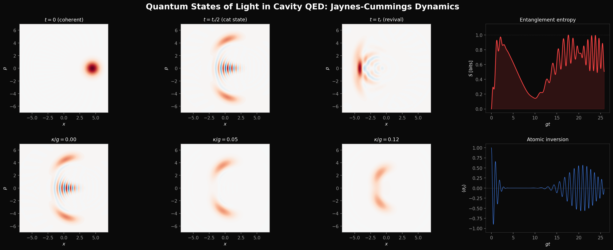

# Quantum States of Light in Cavity QED

**Wigner Function Dynamics and Atom-Field Entanglement in the Jaynes-Cummings Model**

<p align="center">
  
</p>

[](https://arxiv.org/abs/XXXX.XXXXX)
[](LICENSE)
[](https://www.python.org/)
[](https://qutip.org/)

Nguyen Khoi Nguyen (Alan), Boston University  
Advised by Prof. Luca Dal Negro, EC 585 / EC 777

---

## Overview

Computational study of quantum light-matter interaction in the Jaynes-Cummings (JC) model. All dynamics are computed from first principles using QuTiP, with no phenomenological approximations.

**Three principal results:**

1. Time-resolved Wigner function snapshots showing Schrodinger cat-state formation at `t = t_r/2` with Wigner negativity `delta = 0.43`
2. Systematic comparison of atom-field entanglement entropy across coherent, thermal, squeezed, and Fock initial field states
3. Quantitative decoherence study: cavity decay `kappa/g = 0.02` reduces cat-state Wigner negativity by over 80%

---

## Animations

### Wigner Function Evolution

<p align="center">
  
</p>

A coherent state `|alpha = sqrt(10)>` evolves under the resonant JC Hamiltonian. During the collapse of Rabi oscillations, the intracavity field splits into a superposition of two phase-space components — a Schrodinger cat state. **Left:** Wigner function `W(x,p)` of the reduced cavity field state `rho_field = Tr_atom[rho]`, computed on a 200x200 phase-space grid. Interference fringes between the two coherent components produce negative regions (`W < 0`, blue), the hallmark of non-classicality. **Right:** Atomic inversion `<sigma_z>(t)` with a moving time marker. The animation pauses at the cat-state time (`t = t_r/2`) where the field is maximally entangled with the atom, and at the first revival (`t = t_r = 2*pi*sqrt(n_bar)/g`) where the system approximately refactorizes.

### Entanglement, Inversion, and Purity

<p align="center">
  
</p>

Simultaneous evolution of three complementary observables. **Left:** Wigner function `W(x,p)`. **Center:** Atomic inversion `<sigma_z>(t)`. **Right:** Von Neumann entanglement entropy `S(rho_atom)` (red) and field-state purity `Tr[rho_field^2]` (green). Entropy saturates at 1 bit during the collapse window (atom and field become maximally entangled, cat state forms), while purity drops to ~0.5 — consistent with a statistical mixture of two near-orthogonal coherent components. Both quantities recover partially at the first revival as the composite state approximately refactorizes.

### Decoherence Destroys the Cat State

<p align="center">
  
</p>

Cavity photon loss via the Lindblad dissipator `kappa * D[a]` erases quantum coherence on a timescale `~ 1/(kappa * n_bar)`, far shorter than the bare cavity lifetime `1/kappa`. **Left:** Wigner function at the cat-state time `t = t_r/2` as the decay rate `kappa/g` increases from 0 to 0.15. The interference fringes vanish first (they involve high-order coherences), while the two Gaussian lobes persist — the state decoheres into a classical mixture. **Right:** Wigner negativity volume `delta = integral |W| dxdp - 1` tracking the continuous loss of non-classicality.

### Dressed-State Avoided Crossing

<p align="center">
  
</p>

The JC dressed states `|n, +/->` are the exact eigenstates of the coupled atom-cavity system. As the atom-cavity detuning `Delta = omega_a - omega_c` is swept, the bare-state energies (dashed grey) would cross, but the JC interaction opens an avoided crossing with a gap of `2*g*sqrt(n+1)`. This animation sweeps `Delta/g` from -10 to +10 for manifolds `n = 0, 1, 5, 10` simultaneously, making the `sqrt(n+1)` scaling of the vacuum Rabi splitting directly visible. At large detuning the dressed states approach the bare (uncoupled) states; on resonance the hybridization is maximal.

### Photon Number Distribution Dynamics

<p align="center">
  
</p>

Time evolution of the intracavity photon number distribution `P(n, t) = <n|rho_field(t)|n>` for an initial coherent state with `n_bar = 10`. At `t = 0` the distribution is Poissonian (red dashed envelope). During Rabi oscillations it develops a bimodal structure — photon numbers near `n_bar` split into two peaks separated by `~2*sqrt(n_bar)`, the photon-number signature of the cat state at `t = t_r/2`. The distribution partially recovers toward Poissonian at the first revival `t = t_r`, though it never fully returns due to the anharmonic `sqrt(n+1)` Rabi spectrum.

### Bloch Sphere Trajectory

<p align="center">
  
</p>

The reduced atomic state `rho_atom = Tr_field[rho]` traces a trajectory inside the Bloch sphere. A pure atomic state sits on the surface (`|r| = 1`); entanglement with the field pulls the Bloch vector toward the center (`|r| -> 0`, maximally mixed). **Left:** 3D Bloch sphere trajectory color-coded by time. The atom starts at the excited state (red dot, north pole), spirals inward during collapse as it entangles with the field, reaching near the origin at `t = t_r/2` (gold star), then spirals partially outward at the first revival (green triangle). **Center:** Bloch vector length `|r|(t)` — the dip to near zero confirms maximal atom-field entanglement during collapse. **Right:** Von Neumann entropy `S(rho_atom)`, the information-theoretic mirror of the Bloch vector length. Vertical dashed lines mark the collapse time `t_c`, cat-state time `t_r/2`, and revival time `t_r`.

### Wigner vs Husimi Q-Function

<p align="center">
  
</p>

Side-by-side comparison of the Wigner function `W(x,p)` (top row) and Husimi Q-function `Q(alpha) = <alpha|rho|alpha>/pi` (bottom row) during JC evolution with `n_bar = 10`. Both are quasi-probability distributions over phase space, but they encode different information. **Top:** The Wigner function is the unique quasi-probability whose marginals reproduce the correct position and momentum distributions. It takes negative values — the negativity volume `delta` (shown in each panel) quantifies non-classicality. At `t = t_r/2` the interference fringes between the two cat-state components are sharply resolved. **Bottom:** The Husimi Q is a Gaussian-smoothed Wigner function (`Q = W * G_vacuum`) and is non-negative by construction (`Q >= 0` always). It shows the same two-component structure at the cat-state time, but the interference fringes are completely washed out. This comparison illustrates why Wigner negativity, not Q-function structure, is the proper witness of quantum coherence in phase space.

---

## Static Figures

### Dressed-State Avoided Crossing and sqrt(n+1) Scaling

<p align="center">
  
</p>

**Left:** Dressed-state energy eigenvalues `E_n,+/-` as a function of detuning `Delta/g` for photon manifolds `n = 0` (blue), `1` (orange), `5` (green), `10` (red). Bare (uncoupled) energies shown as dashed grey lines for reference. At resonance (`Delta = 0`), each manifold exhibits an avoided crossing with splitting `Omega_n(0) = 2*g*sqrt(n+1)`, indicated by colored arrows. At large `|Delta|` the dressed states asymptotically approach the bare states (dispersive regime). **Right:** On-resonance splitting `Omega_n(0)/g` vs photon number `n` (black dots), overlaid with the analytic curve `2*sqrt(n+1)` (dashed pink). The highlighted points correspond to the manifolds shown in the left panel. The `sqrt(n+1)` dependence is the quantum-mechanical fingerprint of the quantized field: a classical drive would produce a splitting independent of intensity.

### Photon Number Distribution at Six Key Times

<p align="center">
  
</p>

Snapshots of the intracavity photon number distribution `P(n,t)` at six characteristic times during JC evolution (`n_bar = 10`, `Delta = 0`). **(a)** `t = 0` — initial Poissonian distribution (red dashed curve), peaked at `n_bar = 10` with variance `sigma^2 = n_bar`. **(b)** `t = 0.5*t_c` — early Rabi oscillations shift weight between neighboring Fock states; the distribution is still approximately unimodal. **(c)** `t = 2*t_c` — onset of collapse; the distribution begins to broaden asymmetrically as different Fock components oscillate at incommensurate `sqrt(n+1)` frequencies. **(d)** `t = t_r/2` (cat state) — the distribution develops a clear bimodal structure with peaks separated by `~2*sqrt(n_bar) ~ 6` photons, the number-space signature of the two coherent components of the Schrodinger cat state. **(e)** `t = 0.75*t_r` — partial recombination, intermediate between cat and revival. **(f)** `t = t_r` (first revival) — the distribution partially recovers a unimodal shape, though it remains broader and more irregular than the initial Poissonian due to the anharmonicity of the JC energy spectrum.

### Bloch Sphere Dynamics of the Reduced Atomic State

<p align="center">
  
</p>

**Left:** 3D trajectory of the reduced atomic Bloch vector `r = (Tr[rho_atom * sigma_x], Tr[rho_atom * sigma_y], Tr[rho_atom * sigma_z])` during one full collapse-revival cycle. The atom starts at the excited state (red dot, `|r| = 1`) on the Bloch sphere surface. As it entangles with the coherent-state field, the Bloch vector spirals inward, reaching the origin at `t = t_r/2` (gold star) — a maximally mixed state indicating maximal entanglement. It then spirals partially outward at the first revival (green triangle). The color gradient encodes time progression. **Center:** Bloch vector length `|r|(t)`. The collapse from `|r| ~ 1` to `|r| ~ 0` occurs over the collapse time `t_c ~ 1/g`. The minimum near `t_r/2` confirms the atom is maximally entangled with the field. **Right:** Von Neumann entropy `S(rho_atom)`, which reaches ~1 bit (maximally entangled qubit) during collapse and dips at the revival. Vertical dashed lines mark `t_c` (blue), `t_r/2` (pink), and `t_r` (purple).

### Wigner vs Husimi Q-Function Comparison

<p align="center">
  
</p>

Side-by-side snapshots of the Wigner function `W(x,p)` (top row) and Husimi Q-function `Q(alpha)` (bottom row) at seven characteristic times during JC evolution (`n_bar = 10`). Each Wigner panel is annotated with the Wigner negativity volume `delta`. At `t = 0`, both representations show the initial coherent state as a Gaussian blob; `delta ~ 0` confirms near-classical statistics. By `t = t_r/2` (cat state), the Wigner function exhibits pronounced oscillatory fringes between the two coherent lobes with `delta = 0.85`, while the Q-function shows only two smooth, positive peaks — the interference information is erased by the intrinsic Gaussian convolution. At `t = t_r` (revival), the Wigner function partially re-localizes but retains residual negativity (`delta = 0.31`), reflecting imperfect refactorization of the atom-field state. The comparison demonstrates that the Husimi Q is fundamentally unable to witness quantum interference in phase space.

### Cat-State Detail

<p align="center">
  
</p>

Cross-section `W(x, p=0)` through the Wigner function at the cat-state time `t = t_r/2`. The two positive peaks correspond to the two coherent components of the Schrodinger cat state, separated by `~2*sqrt(2*n_bar)` in phase space. Between them, deep negative fringes reach `W ~ -0.22`, with fringe spacing `~ pi / sqrt(2*n_bar) ~ 0.7`. The negativity is a direct measure of quantum coherence between macroscopically distinguishable field states.

### Entanglement Across Field States

<p align="center">
  
</p>

Von Neumann entanglement entropy `S(rho_atom)` for four different initial field states, all with `n_bar = 10`. **Coherent** (blue): clean collapse to ~1 bit followed by a well-defined revival dip at `t_r`. **Fock** (orange): periodic oscillations at the single frequency `2*g*sqrt(n+1)` with no collapse or revival. **Thermal** (green): rapid rise to ~1 bit followed by permanent saturation — the broad Bose-Einstein photon statistics cause irreversible dephasing with no revival structure. **Squeezed** (red): intermediate behavior — the narrower-than-Poisson number distribution produces a faster collapse but a less clean revival. Only the coherent state, with its tightly peaked Poisson distribution, supports the rephasing condition needed for revivals.

### Entropy Scaling with Photon Number

<p align="center">
  
</p>

Entanglement entropy `S(rho_atom)` vs time for coherent-state initial fields at several values of `n_bar`. The collapse time `t_c ~ 1/g` is independent of `n_bar`, while the revival time `t_r = 2*pi*sqrt(n_bar)/g` scales as `sqrt(n_bar)`. For small `n_bar` (e.g. `n_bar = 1`), the Rabi oscillations are nearly periodic and the system never fully entangles. Clean collapse-revival structure with well-defined entropy dips emerges for `n_bar >= 9`, where the Poisson distribution is sufficiently peaked to produce a narrow spread of Rabi frequencies.

### Dissipative Entanglement

<p align="center">
  
</p>

Effect of cavity dissipation on atom-field entanglement. Entropy dynamics are computed via the Lindblad master equation `d*rho/dt = -i[H,rho] + kappa*D[a]*rho` at several values of `kappa/g`. At `kappa = 0` the entropy exhibits the full collapse-revival pattern. As `kappa` increases, the revival dip is progressively suppressed: photon loss decoheres the field state, destroying the rephasing condition. By `kappa/g = 0.05` the revival is absent entirely and the entropy remains near maximal.

### Decoherence Table

| `kappa/g` | Wigner negativity `delta` | Field purity | Cat state visible? |
|-----------|--------------------------|--------------|-------------------|
| 0.00      | 0.425                    | 0.960        | Yes               |
| 0.02      | 0.071                    | 0.460        | Marginal          |
| 0.05      | 0.011                    | 0.418        | No                |
| 0.10      | < 0.001                  | 0.386        | No                |

Wigner negativity volume `delta` and field-state purity `Tr[rho_field^2]` at the cat-state time `t = t_r/2` for increasing cavity decay rates. The cat state is effectively destroyed at `kappa/g = 0.05`, while the field purity remains finite — confirming that decoherence (loss of off-diagonal coherence) proceeds much faster than energy dissipation (loss of photons).

### Coherent vs Thermal Inversion

<p align="center">
  
</p>

Atomic inversion `<sigma_z>(t) = sum_n P(n) cos(2*g*sqrt(n+1)*t)` for coherent (Poisson) and thermal (Bose-Einstein) initial field states with the same `n_bar = 10`. **Left:** The Poisson distribution's narrow width produces collapse-revival dynamics — the incommensurate `sqrt(n+1)` frequencies dephase during collapse, then rephase at `t_r = 2*pi*sqrt(n_bar)/g`. **Right:** The exponentially broad Bose-Einstein distribution produces permanent dephasing with no revival — the frequency spread is too wide for rephasing to occur.

### Mollow Triplet

<p align="center">
  
</p>

Resonance fluorescence spectrum of a strongly driven two-level atom, computed via the quantum regression theorem (`QuTiP correlation_2op_1t`). In the strong-driving limit (`Omega >> gamma`), the spectrum splits into three peaks: a central peak at the laser frequency with HWHM `gamma/2`, and two sidebands at `+/- Omega` with HWHM `3*gamma/4`. The peak-height ratio approaches 3:1 (sidebands : center). Multiple driving strengths are overlaid to show the continuous emergence of the triplet from the weak-driving (Rayleigh scattering) regime.

### Static Wigner Functions for Fock States

<p align="center">
  
</p>

Wigner functions `W_n(x,p) = (-1)^n / pi * L_n(2*r^2) * exp(-r^2)` for Fock states `|n>` with `n = 0, 1, 2, ...`. The vacuum `|0>` is a positive Gaussian. Each additional photon adds one concentric ring of alternating sign, with the value at the origin given by `W_n(0,0) = (-1)^n / pi`. The ring structure and growing negativity volume illustrate that Fock states become increasingly non-classical with photon number — despite being energy eigenstates of the free field.

---

## Repository Structure

```
.
├── paper/
│   ├── merged_paper.tex              # Full manuscript (REVTeX 4.2)
│   └── figures/                      # All static figures (PDF + PNG) + banner
│
├── simulations/
│   ├── utils.py                      # JC operators, initial states, timescales
│   ├── sim_wigner_evolution.py       # Wigner W(x,p) dynamics + decoherence
│   ├── sim_entanglement_dynamics.py  # Von Neumann entropy + purity + scaling
│   ├── sim_avoided_crossing.py       # Dressed-state energy levels + sqrt(n+1)
│   ├── sim_photon_number_distribution.py  # P(n,t) snapshots + animation
│   ├── sim_bloch_sphere.py           # Bloch trajectory + |r|(t) + entropy
│   ├── sim_q_vs_wigner.py            # Wigner vs Husimi Q comparison
│   ├── jaynes_cummings_comparison.py # Coherent vs thermal inversion
│   ├── mollow_triplet.py             # Fluorescence spectrum via regression theorem
│   └── wigner_fock_states.py         # Static Wigner functions for Fock states
│
├── animations/
│   ├── anim_wigner_evolution.py      # Wigner evolution GIF generator
│   ├── anim_entanglement.py          # Entropy + Wigner GIF generator
│   ├── anim_decoherence.py           # Decoherence sweep GIF generator
│   ├── anim_avoided_crossing.py      # Dressed-state sweep GIF generator
│   ├── anim_photon_number.py         # P(n,t) evolution GIF generator
│   ├── anim_bloch_sphere.py          # Bloch sphere trajectory GIF generator
│   ├── anim_q_vs_wigner.py           # W vs Q comparison GIF generator
│   ├── thumbnail_banner.py           # Dark banner image generator
│   ├── anim_wigner_evolution.gif     # 120 frames, 2.6 MB
│   ├── anim_entanglement.gif         # 120 frames, 2.3 MB
│   ├── anim_decoherence.gif          # 60 frames, 750 KB
│   ├── anim_avoided_crossing.gif     # ~80 frames, 1.4 MB
│   ├── anim_photon_number.gif        # ~80 frames, 1.5 MB
│   ├── anim_bloch_sphere.gif         # ~80 frames, 1.5 MB
│   └── anim_q_vs_wigner.gif          # 80 frames, 4.2 MB
│
├── figures/                          # New computational figures (PDF + PNG)
│   ├── fig_avoided_crossing.*
│   ├── fig_photon_number_evolution.*
│   ├── fig_bloch_sphere_trajectory.*
│   └── fig_q_vs_wigner.*
│
├── requirements.txt
├── LICENSE
└── README.md
```

## Simulation Details

### Jaynes-Cummings Hamiltonian

```
H_JC = omega_c a^dag a + (omega_a / 2) sigma_z + g (a^dag sigma^- + a sigma^+)
```

On resonance (`omega_a = omega_c`): `H = g (a^dag sigma^- + a sigma^+)`.

### Dressed States

The eigenstates of the `n`-th excitation manifold:

```
|n, +> = cos(theta_n) |e, n> + sin(theta_n) |g, n+1>
|n, -> = -sin(theta_n) |e, n> + cos(theta_n) |g, n+1>
```

with mixing angle `tan(2*theta_n) = 2*g*sqrt(n+1) / Delta` and eigenvalues `E_n,+/- = (n + 1/2)*omega_c +/- Omega_n/2`, where the generalized Rabi frequency is `Omega_n = sqrt(Delta^2 + 4*g^2*(n+1))`.

### Lindblad Master Equation

```
d rho / dt = -i [H, rho] + kappa D[a] rho + gamma D[sigma^-] rho
```

where `D[c] rho = c rho c^dag - (c^dag c rho + rho c^dag c)/2`.

### Wigner Negativity Volume

```
delta = integral |W(x,p)| dx dp - 1
```

`delta = 0` for classical states (coherent, thermal). `delta > 0` for non-classical states (Fock, cat, squeezed).

### Husimi Q-Function

```
Q(alpha) = <alpha| rho |alpha> / pi
```

Related to the Wigner function by Gaussian convolution: `Q = W * G_vacuum`. Non-negative by construction, but cannot resolve quantum interference.

### Von Neumann Entropy

```
S(rho_atom) = -Tr[rho_atom log_2 rho_atom]
```

Ranges from 0 (product state) to 1 bit (maximally entangled qubit).

### Bloch Vector

```
r = (Tr[rho_atom sigma_x], Tr[rho_atom sigma_y], Tr[rho_atom sigma_z])
```

`|r| = 1` for pure states (surface of Bloch sphere). `|r| = 0` for maximally mixed state (center). Related to purity by `Tr[rho_atom^2] = (1 + |r|^2) / 2`.

### Mollow Spectrum

Eigenvalues of the Bloch matrix on resonance:

```
lambda_0 = -gamma/2           (central peak, HWHM = gamma/2)
lambda_+/- = -3gamma/4 +/- i Omega   (sidebands, HWHM = 3gamma/4)
```

### Parameters

| Parameter | Symbol | Default |
|-----------|--------|---------|
| Vacuum Rabi coupling | `g` | 1.0 |
| Mean photon number | `n_bar` | 10 |
| Fock truncation | `N_cav` | 35-50 |
| Cavity decay | `kappa/g` | 0-0.2 |
| Collapse time | `t_c` | `~ 1/g` |
| Revival time | `t_r` | `2 pi sqrt(n_bar) / g` |

### Figure-to-Script Map

| Output | Script |
|--------|--------|
| `fig_avoided_crossing` | `sim_avoided_crossing.py` |
| `fig_photon_number_evolution` | `sim_photon_number_distribution.py` |
| `fig_bloch_sphere_trajectory` | `sim_bloch_sphere.py` |
| `fig_q_vs_wigner` | `sim_q_vs_wigner.py` |
| `fig_inversion_snapshots` | `sim_wigner_evolution.py` |
| `fig_wigner_evolution` | `sim_wigner_evolution.py` |
| `fig_cat_state_detail` | `sim_wigner_evolution.py` |
| `fig_wigner_decoherence` | `sim_wigner_evolution.py` |
| `fig_entanglement_comparison` | `sim_entanglement_dynamics.py` |
| `fig_coherent_entropy_purity` | `sim_entanglement_dynamics.py` |
| `fig_entropy_nbar_scaling` | `sim_entanglement_dynamics.py` |
| `fig_dissipative_entanglement` | `sim_entanglement_dynamics.py` |
| `jaynes_cummings_comparison` | `jaynes_cummings_comparison.py` |
| `mollow_triplet_driving_strength` | `mollow_triplet.py` |
| `wigner_fock_combined` | `wigner_fock_states.py` |
| `anim_wigner_evolution.gif` | `anim_wigner_evolution.py` |
| `anim_entanglement.gif` | `anim_entanglement.py` |
| `anim_decoherence.gif` | `anim_decoherence.py` |
| `anim_avoided_crossing.gif` | `anim_avoided_crossing.py` |
| `anim_photon_number.gif` | `anim_photon_number.py` |
| `anim_bloch_sphere.gif` | `anim_bloch_sphere.py` |
| `anim_q_vs_wigner.gif` | `anim_q_vs_wigner.py` |
| `banner_qsol.png` | `thumbnail_banner.py` |

---

## Quick Start

```bash
git clone https://github.com/alanknguyen/QSOL_CQED.git
cd QSOL_CQED
pip install -r requirements.txt
```

Static figures:

```bash
cd simulations
python sim_wigner_evolution.py            # ~2 min
python sim_entanglement_dynamics.py       # ~5 min
python sim_avoided_crossing.py            # ~30 sec
python sim_photon_number_distribution.py  # ~1 min
python sim_bloch_sphere.py                # ~2 min
python sim_q_vs_wigner.py                 # ~3 min
python jaynes_cummings_comparison.py      # ~10 sec
python mollow_triplet.py                  # ~1 min
python wigner_fock_states.py              # ~5 sec
```

Animations:

```bash
cd animations
python anim_wigner_evolution.py           # ~5 min
python anim_entanglement.py              # ~5 min
python anim_decoherence.py              # ~3 min
python anim_avoided_crossing.py          # ~2 min
python anim_photon_number.py             # ~3 min
python anim_bloch_sphere.py              # ~3 min
python anim_q_vs_wigner.py              # ~8 min
python thumbnail_banner.py              # ~30 sec
```

---

## Citation

```bibtex
@article{nguyen2025quantum,
  author  = {Nguyen, Nguyen Khoi},
  title   = {Quantum States of Light in Cavity {QED}: A Computational Study
             of {Wigner} Function Dynamics and Atom-Field Entanglement
             in the {Jaynes-Cummings} Model},
  journal = {arXiv preprint arXiv:XXXX.XXXXX},
  year    = {2025},
}
```

## License

MIT. See [LICENSE](LICENSE).

## Acknowledgments

Prepared under the guidance of Prof. Luca Dal Negro at Boston University (EC 585, EC 777). Simulations use [QuTiP](https://qutip.org/) by J. R. Johansson, P. D. Nation, and F. Nori.