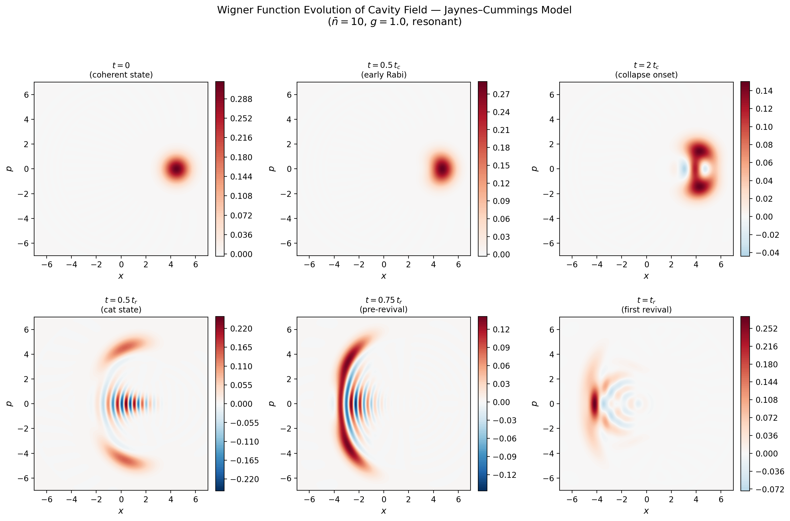
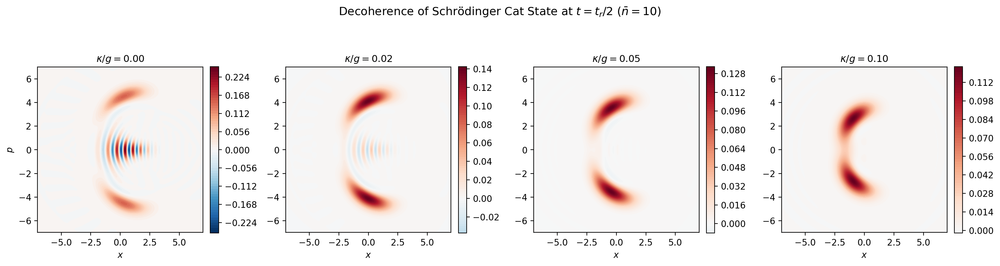
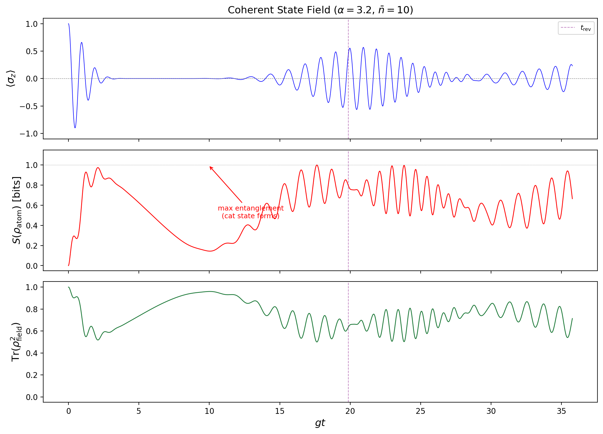

# Quantum States of Light in Cavity QED

**Wigner Function Dynamics and Atom-Field Entanglement in the Jaynes-Cummings Model**

[](https://arxiv.org/abs/XXXX.XXXXX)
[](LICENSE)
[](https://www.python.org/)
[](https://qutip.org/)

Nguyen Khoi Nguyen (Alan), Boston University  
Advised by Prof. Luca Dal Negro

---

## Overview

This repository contains the manuscript, simulation code, and figures for a computational study of quantum light-matter interaction in the Jaynes-Cummings (JC) model. All spectra and dynamics are computed from first principles using QuTiP, with no phenomenological approximations.

**Three principal results:**

1. Time-resolved Wigner function snapshots of the cavity field during JC dynamics, showing a Schrodinger cat state forming at `t = t_r/2` with Wigner negativity volume `delta = 0.43`
2. Systematic comparison of atom-field entanglement entropy `S(rho_atom)` across coherent, thermal, squeezed, and Fock initial field states
3. Quantitative study of decoherence via the Lindblad master equation: cavity decay as low as `kappa/g = 0.02` reduces cat-state Wigner negativity by over 80%

---

## Results

### Cat-State Formation in Phase Space

During JC evolution with an initial coherent field (`n_bar = 10`), the cavity field splits into a macroscopic superposition at half the revival time. The Wigner function develops two lobes connected by interference fringes with deep negativity.

<p align="center">
  
</p>

Six snapshots of `W(x,p)` for the reduced cavity field. At `t = 0`, a displaced Gaussian (coherent state). By `t = t_r/2`, a Schrodinger cat state with pronounced Wigner negativity. At `t = t_r`, partial re-localization at revival.

<p align="center">
  
</p>

Left: Wigner function contour at the cat-state time. Right: cross-section `W(x, p=0)` confirming `W < 0` between the two coherent components. The interference fringe spacing `Delta x ~ pi / sqrt(2 n_bar) ~ 0.7` is set by the component separation in phase space.

### Decoherence Destroys Non-Classical Features

<p align="center">
  
</p>

Wigner function at `t = t_r/2` under Lindblad cavity decay. The interference fringes are erased on a timescale `~ 1/(kappa * n_bar)`, much faster than the bare cavity lifetime `1/kappa`.

| `kappa/g` | Wigner negativity `delta` | Field purity | Cat state visible? |
|-----------|--------------------------|--------------|-------------------|
| 0.00      | 0.425                    | 0.960        | Yes               |
| 0.02      | 0.071                    | 0.460        | Marginal          |
| 0.05      | 0.011                    | 0.418        | No                |
| 0.10      | < 0.001                  | 0.386        | No                |

### Entanglement Entropy Across Field States

<p align="center">
  
</p>

Top: atomic inversion `<sigma_z>`. Bottom: von Neumann entropy `S(rho_atom)` in bits. Only the coherent state (blue) shows a clean entropy dip at the revival time `t_r`. The Fock state oscillates periodically (single Rabi frequency). Thermal and squeezed fields dephase irreversibly.

<p align="center">
  
</p>

Three-observable portrait for the coherent-state field: inversion collapses when entropy saturates at 1 bit and field purity drops to 0.5 (two-component cat). All three recover partially at revival.

### Entropy Scaling with Mean Photon Number

<p align="center">
  
</p>

Collapse time `t_c ~ 1/g` is independent of `n_bar`. Revival time `t_r = 2 pi sqrt(n_bar) / g` grows with `n_bar`, producing a broader plateau of maximal entanglement. Clean revival dips emerge for `n_bar >= 9`.

### Dissipative Entanglement Dynamics

<p align="center">
  
</p>

Cavity decay damps Rabi oscillations and smears the revival feature in `S(rho_atom)`. At `kappa/g = 0.05`, the entropy dip at `t_r` is barely visible. At `kappa/g = 0.20`, it is gone.

### Collapse and Revival: Coherent vs Thermal Field

<p align="center">
  
</p>

Atomic inversion `W(t) = sum_n P(n) cos(2 sqrt(n+1) t)` for `n_bar = 4, 9, 14, 19, 24`. Left: coherent state (Poisson distribution) shows collapse-revival structure. Right: thermal state (Bose-Einstein distribution) dephases permanently. Revivals require a discrete, narrow photon-number distribution.

### Mollow Triplet

<p align="center">
  
</p>

Resonance fluorescence spectrum computed via the quantum regression theorem (QuTiP `correlation_2op_1t`). For `Omega < gamma`, a single Lorentzian. For `Omega >> gamma`, a triplet at `omega_L` and `omega_L +/- Omega` with peak height ratio 3:1 and sideband HWHM = `3 gamma/4`. No phenomenological Lorentzian fitting; the spectrum follows exactly from the eigenvalues of the Bloch equation matrix.

### Static Wigner Functions

<p align="center">
  
</p>

`W_n(x,p) = (-1)^n / pi * L_n(2 r^2) * exp(-r^2)`. Vacuum `|0>` is a Gaussian with no negativity. Higher Fock states develop ring structures with `n` sign changes, reflecting non-classicality.

---

## Repository Structure

```
.
├── paper/
│   ├── merged_paper.tex              # Full manuscript (REVTeX 4.2)
│   └── figures/                      # All figures (PDF + PNG)
│
├── simulations/
│   ├── utils.py                      # JC operators, initial states, timescales
│   ├── sim_wigner_evolution.py       # Wigner W(x,p) dynamics + decoherence
│   ├── sim_entanglement_dynamics.py  # Von Neumann entropy + purity + scaling
│   ├── jaynes_cummings_comparison.py # Coherent vs thermal inversion
│   ├── mollow_triplet.py             # Fluorescence spectrum via regression theorem
│   └── wigner_fock_states.py         # Static Wigner functions for Fock states
│
├── requirements.txt
├── LICENSE
└── README.md
```

## Simulation Details

### Jaynes-Cummings Hamiltonian

All JC simulations solve, in the rotating frame with `Delta = omega_a - omega_c`:

```
H_JC = omega_c * a^dag a + (omega_a / 2) * sigma_z + g * (a^dag sigma^- + a sigma^+)
```

On resonance (`Delta = 0`) this reduces to `H = g * (a^dag sigma^- + a sigma^+)`.

### Lindblad Master Equation

Dissipative dynamics are governed by:

```
d rho / dt = -i [H_JC, rho] + kappa * D[a] rho + gamma * D[sigma^-] rho
```

where `D[L] rho = L rho L^dag - (L^dag L rho + rho L^dag L) / 2`.

### Wigner Function

Computed on a 200 x 200 grid over `[-7, 7]^2` via QuTiP's `wigner()` (Laguerre polynomial method). Non-classicality is quantified by the Wigner negativity volume:

```
delta = integral |W(x,p)| dx dp - 1
```

`delta = 0` for all classical states; `delta > 0` indicates non-classicality.

### Entanglement Entropy

For a bipartite pure state, the von Neumann entropy of the reduced atomic state:

```
S(rho_atom) = -Tr[rho_atom log_2 rho_atom]
```

ranges from 0 (product state) to 1 bit (maximally entangled).

### Mollow Spectrum

Computed exactly via the quantum regression theorem. The two-time correlator `<sigma+(tau) sigma-(0)>_ss` is evaluated using QuTiP's `correlation_2op_1t`, with the elastic (coherent) component `<sigma+>_ss <sigma->_ss` subtracted. The incoherent spectrum is the Fourier cosine transform of the result.

On resonance, the Bloch equation matrix:

```
M = [[-gamma/2,    0,       0    ],
     [  0,      -gamma/2,  Omega ],
     [  0,      -Omega,   -gamma ]]
```

has eigenvalues `-gamma/2` (central peak) and `-3 gamma/4 +/- i Omega` (sidebands), giving HWHM = `gamma/2` and `3 gamma/4` respectively.

### Parameters

All simulations use dimensionless units with `g = 1`.

| Parameter | Symbol | Default |
|-----------|--------|---------|
| Vacuum Rabi coupling | `g` | 1.0 (time/energy unit) |
| Mean photon number | `n_bar` | 10 |
| Fock space truncation | `N_cav` | 35-50 |
| Cavity decay rate | `kappa/g` | 0 (unitary) / 0-0.2 (dissipative) |
| Spontaneous emission | `gamma/g` | 0 |
| Collapse time | `t_c` | `~ 1/g` |
| Revival time | `t_r` | `2 pi sqrt(n_bar) / g` |

### Figure-to-Script Map

| Figure | Script | Description |
|--------|--------|-------------|
| `fig_inversion_snapshots` | `sim_wigner_evolution.py` | `<sigma_z>(t)` with Wigner snapshot markers |
| `fig_wigner_evolution` | `sim_wigner_evolution.py` | 6-panel Wigner `W(x,p)` time evolution |
| `fig_cat_state_detail` | `sim_wigner_evolution.py` | Cat state contour + `W(x, 0)` cross-section |
| `fig_wigner_decoherence` | `sim_wigner_evolution.py` | `W(x,p)` at `t_r/2` for `kappa/g = 0, 0.02, 0.05, 0.10` |
| `fig_entanglement_comparison` | `sim_entanglement_dynamics.py` | Inversion + entropy for 4 field states |
| `fig_coherent_entropy_purity` | `sim_entanglement_dynamics.py` | Inversion + entropy + purity (coherent) |
| `fig_entropy_nbar_scaling` | `sim_entanglement_dynamics.py` | `S(t)` for `n_bar = 1, 4, 9, 16, 25, 36` |
| `fig_dissipative_entanglement` | `sim_entanglement_dynamics.py` | Inversion + entropy for `kappa/g = 0` to `0.20` |
| `jaynes_cummings_comparison` | `jaynes_cummings_comparison.py` | Coherent vs thermal inversion at 5 `n_bar` values |
| `mollow_triplet_driving_strength` | `mollow_triplet.py` | Fluorescence spectrum vs `Omega/gamma` |
| `wigner_fock_combined` | `wigner_fock_states.py` | Static `W(x,p)` for Fock states `n = 0` to `7` |

---

## Quick Start

```bash
git clone https://github.com/alanknguyen/QSOL_CQED.git
cd QSOL_CQED
pip install -r requirements.txt
```

Reproduce all figures:

```bash
cd simulations
python sim_wigner_evolution.py            # ~2 min
python sim_entanglement_dynamics.py       # ~5 min
python jaynes_cummings_comparison.py      # ~10 sec
python mollow_triplet.py                  # ~1 min
python wigner_fock_states.py              # ~5 sec
```

Figures are saved as PNG (preview) and PDF (LaTeX) in the working directory.

---

## Citation

```bibtex
@article{nguyen2025quantum,
  author  = {Nguyen, Nguyen Khoi},
  title   = {Quantum States of Light in Cavity {QED}: A Computational Study
             of {Wigner} Function Dynamics and Atom-Field Entanglement
             in the {Jaynes-Cummings} Model},
  journal = {arXiv preprint arXiv:XXXX.XXXXX},
  year    = {2025},
}
```

## License

MIT. See [LICENSE](LICENSE).

## Acknowledgments

Prepared under the guidance of Prof. Luca Dal Negro at Boston University (EC 585). Simulations use [QuTiP](https://qutip.org/) by J. R. Johansson, P. D. Nation, and F. Nori.
