# Quantum States of Light in Cavity QED

**Wigner Function Dynamics and Atom-Field Entanglement in the Jaynes-Cummings Model**

<p align="center">
  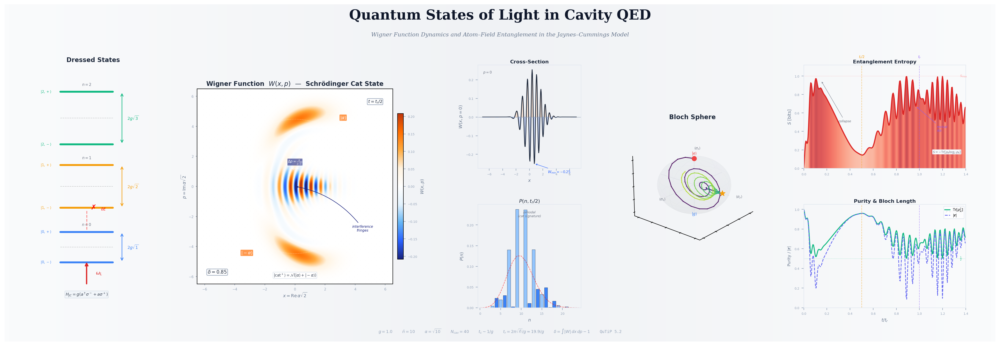
</p>

[](https://arxiv.org/abs/XXXX.XXXXX)
[](LICENSE)
[](https://www.python.org/)
[](https://qutip.org/)

Nguyen Khoi Nguyen (Alan), Boston University  
Advised by Prof. Luca Dal Negro, EC 585 / EC 777

---

## Overview

Computational study of quantum light-matter interaction in the Jaynes-Cummings (JC) model. All dynamics are computed from first principles using QuTiP, with no phenomenological approximations.

**Five principal results:**

1. Time-resolved Wigner function snapshots showing Schrödinger cat-state formation at $t = t_r/2$ with Wigner negativity $\delta = 0.43$
2. Systematic comparison of atom-field entanglement entropy across coherent, thermal, squeezed, and Fock initial field states
3. Quantitative decoherence study: cavity decay $\kappa/g = 0.02$ reduces cat-state Wigner negativity by over 80%
4. **Cat-state survival phase diagram**: 2D parameter sweep of $\delta(\bar{n}, \kappa/g)$ mapping the boundary of observable quantum coherence, plus even-cat-state fidelity
5. **Photon blockade and second-order coherence**: $g^{(2)}(0)$ as a function of coupling strength, drive power, and detuning, demonstrating the quantum-to-classical crossover

---

## Table of Contents

- [Animations](#animations)
- [Static Figures](#static-figures)
- [Extended Theory](#extended-theory)
- [Simulation Details](#simulation-details)
- [Repository Structure](#repository-structure)
- [Quick Start](#quick-start)
- [Citation](#citation)

---

## Animations

### Wigner Function Evolution

<p align="center">
  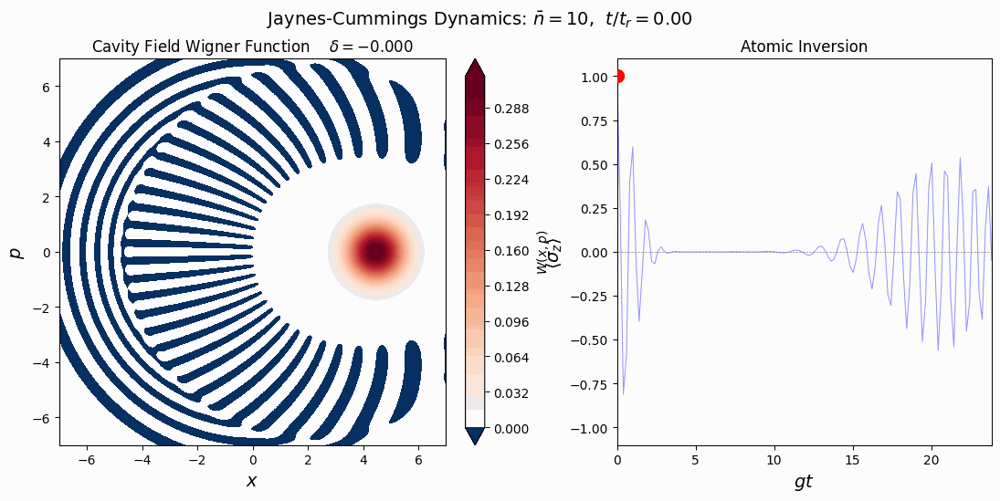
</p>

A coherent state $|\alpha = \sqrt{10}\rangle$ evolves under the resonant JC Hamiltonian. During the collapse of Rabi oscillations, the intracavity field splits into a superposition of two phase-space components — a Schrödinger cat state. **Left:** Wigner function $W(x,p)$ of the reduced cavity field state $\rho_\text{field} = \mathrm{Tr}_\text{atom}[\rho]$, computed on a 200×200 phase-space grid. Interference fringes between the two coherent components produce negative regions ($W < 0$, blue), the hallmark of non-classicality. **Right:** Atomic inversion $\langle\sigma_z\rangle(t)$ with a moving time marker. The animation pauses at the cat-state time ($t = t_r/2$) where the field is maximally entangled with the atom, and at the first revival ($t = t_r = 2\pi\sqrt{\bar{n}}/g$) where the system approximately refactorizes.

### Entanglement, Inversion, and Purity

<p align="center">
  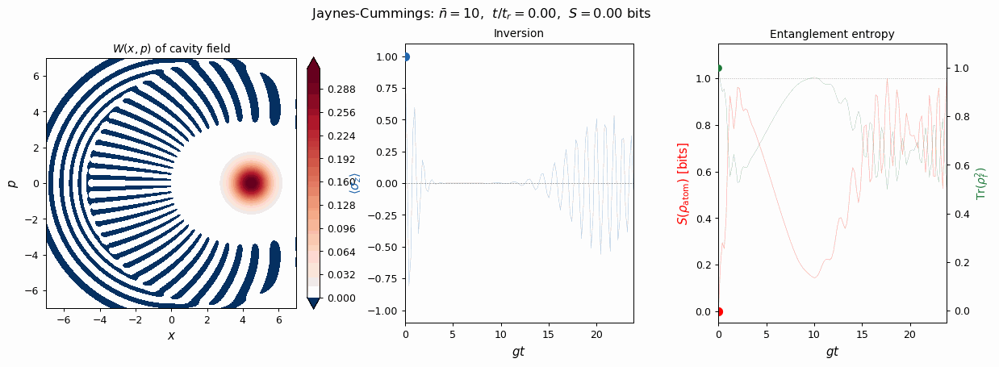
</p>

Simultaneous evolution of three complementary observables. **Left:** Wigner function $W(x,p)$. **Center:** Atomic inversion $\langle\sigma_z\rangle(t)$. **Right:** Von Neumann entanglement entropy $S(\rho_\text{atom})$ (red) and field-state purity $\mathrm{Tr}[\rho_\text{field}^2]$ (green). Entropy saturates at 1 bit during the collapse window (atom and field become maximally entangled, cat state forms), while purity drops to ~0.5 — consistent with a statistical mixture of two near-orthogonal coherent components. Both quantities recover partially at the first revival as the composite state approximately refactorizes.

### Decoherence Destroys the Cat State

<p align="center">
  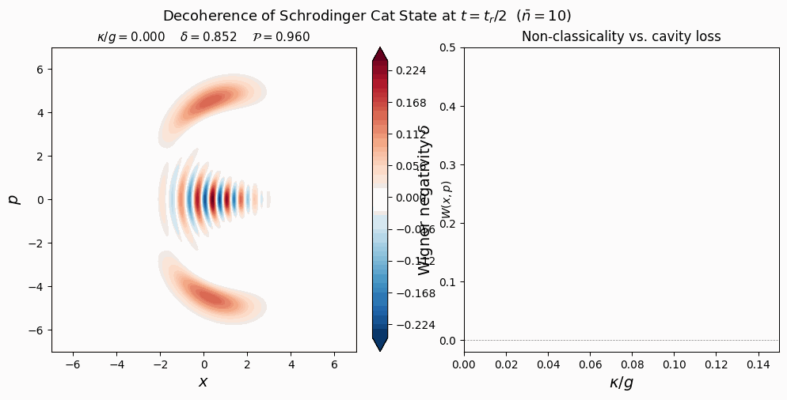
</p>

Cavity photon loss via the Lindblad dissipator $\kappa \mathcal{D}[a]$ erases quantum coherence on a timescale $\sim 1/(\kappa \bar{n})$, far shorter than the bare cavity lifetime $1/\kappa$. **Left:** Wigner function at the cat-state time $t = t_r/2$ as the decay rate $\kappa/g$ increases from 0 to 0.15. The interference fringes vanish first (they involve high-order coherences), while the two Gaussian lobes persist — the state decoheres into a classical mixture. **Right:** Wigner negativity volume $\delta$ tracking the continuous loss of non-classicality.

### Dressed-State Avoided Crossing

<p align="center">
  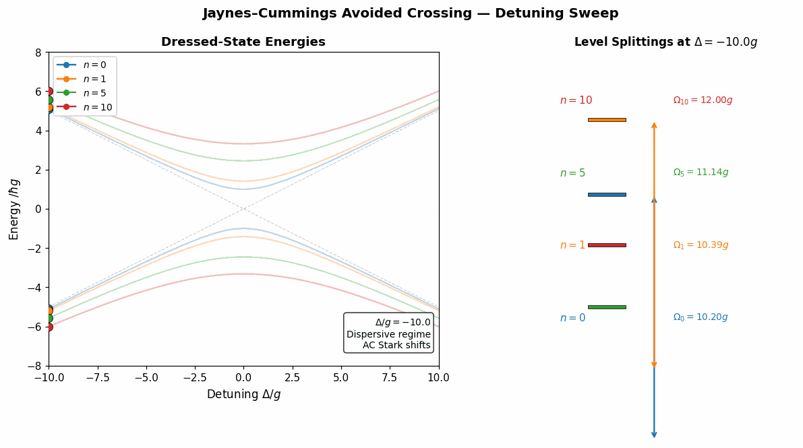
</p>

The JC dressed states $|n, \pm\rangle$ are the exact eigenstates of the coupled atom-cavity system. As the atom-cavity detuning $\Delta = \omega_a - \omega_c$ is swept, the bare-state energies (dashed grey) would cross, but the JC interaction opens an avoided crossing with a gap of $2g\sqrt{n+1}$. This animation sweeps $\Delta/g$ from $-10$ to $+10$ for manifolds $n = 0, 1, 5, 10$ simultaneously, making the $\sqrt{n+1}$ scaling of the vacuum Rabi splitting directly visible. At large detuning the dressed states approach the bare (uncoupled) states; on resonance the hybridization is maximal.

### Photon Number Distribution Dynamics

<p align="center">
  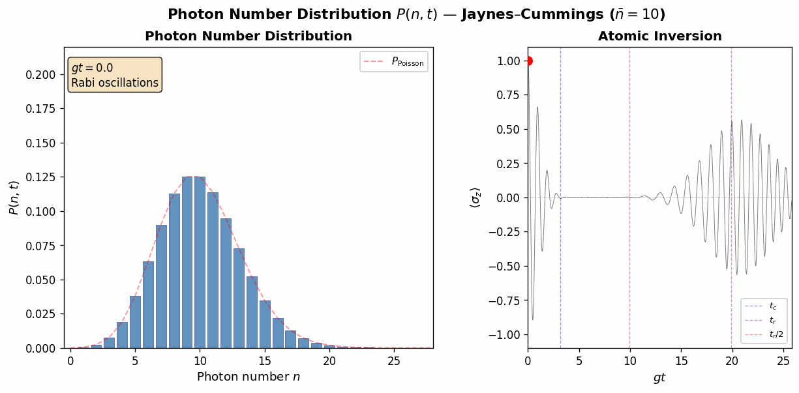
</p>

Time evolution of the intracavity photon number distribution $P(n, t) = \langle n|\rho_\text{field}(t)|n\rangle$ for an initial coherent state with $\bar{n} = 10$. At $t = 0$ the distribution is Poissonian (red dashed envelope). During Rabi oscillations it develops a bimodal structure — photon numbers near $\bar{n}$ split into two peaks separated by $\sim 2\sqrt{\bar{n}}$, the photon-number signature of the cat state at $t = t_r/2$. The distribution partially recovers toward Poissonian at the first revival $t = t_r$, though it never fully returns due to the anharmonic $\sqrt{n+1}$ Rabi spectrum.

### Bloch Sphere Trajectory

<p align="center">
  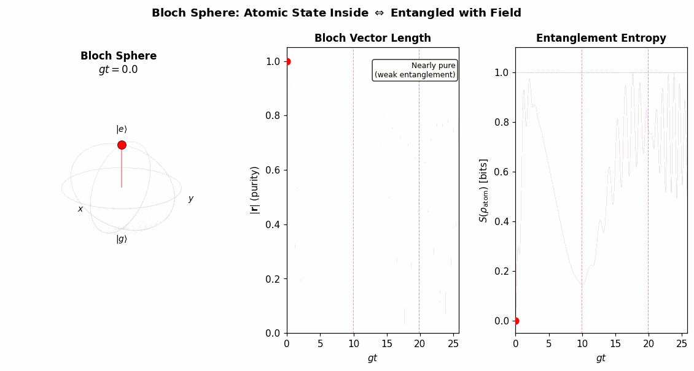
</p>

The reduced atomic state $\rho_\text{atom} = \mathrm{Tr}_\text{field}[\rho]$ traces a trajectory inside the Bloch sphere. A pure atomic state sits on the surface ($|\mathbf{r}| = 1$); entanglement with the field pulls the Bloch vector toward the center ($|\mathbf{r}| \to 0$, maximally mixed). **Left:** 3D Bloch sphere trajectory color-coded by time. The atom starts at the excited state (red dot, north pole), spirals inward during collapse, reaching near the origin at $t = t_r/2$ (gold star), then spirals partially outward at the first revival (green triangle). **Center:** Bloch vector length $|\mathbf{r}|(t)$. **Right:** Von Neumann entropy $S(\rho_\text{atom})$.

### Wigner vs Husimi Q-Function

<p align="center">
  
</p>

Side-by-side comparison of the Wigner function $W(x,p)$ (top row) and Husimi Q-function $Q(\alpha) = \langle\alpha|\rho|\alpha\rangle/\pi$ (bottom row) during JC evolution with $\bar{n} = 10$. The Wigner function takes negative values — the negativity volume $\delta$ (shown in each panel) quantifies non-classicality. The Husimi Q is a Gaussian-smoothed Wigner function ($Q = W * G_\text{vacuum}$) and is non-negative by construction ($Q \geq 0$ always). At $t = t_r/2$ the Wigner function resolves the interference fringes sharply, while the Q-function shows only two smooth lobes. This demonstrates that Wigner negativity, not Q-function structure, is the proper witness of quantum coherence in phase space.

### Cat-State Decoherence Sweep

<p align="center">
  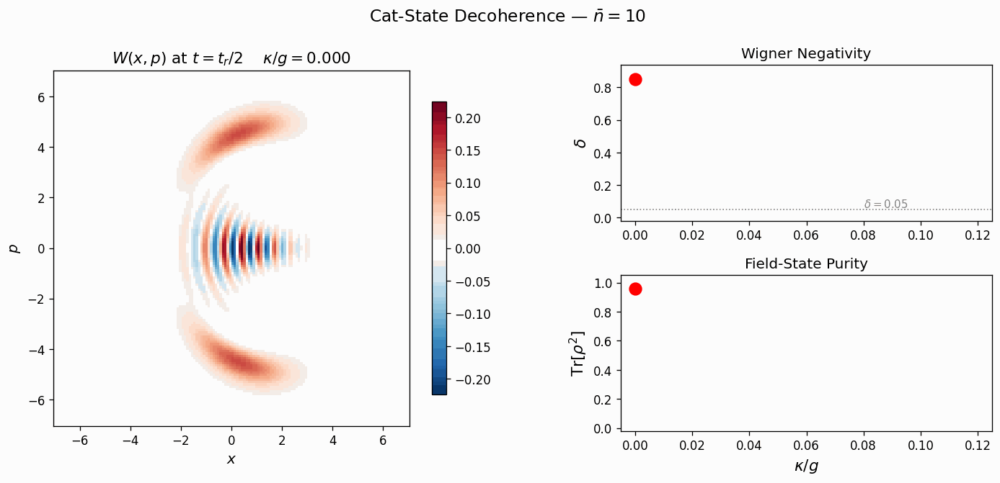
</p>

The cat state at $t = t_r/2$ is progressively destroyed as cavity decay $\kappa/g$ increases from 0 to 0.12, with $\bar{n} = 10$ held fixed. **Left:** Wigner function $W(x,p)$ of the reduced cavity field. At $\kappa = 0$, the full interference pattern is visible between the two coherent lobes — deep negative fringes certifying a macroscopic quantum superposition. As $\kappa$ increases, the fringes wash out first (they are encoded in high-order off-diagonal elements $\langle n|\rho|n + 2k\rangle$ with $k \gg 1$), while the two classical lobes persist longer. By $\kappa/g \approx 0.04$ the Wigner function is everywhere positive — the cat has decohered into a classical mixture. **Right top:** Wigner negativity volume $\delta(\kappa/g)$ tracing the quantitative loss of non-classicality; the horizontal grey line marks $\delta = 0.05$, our operational threshold for observability. **Right bottom:** Field-state purity $\mathrm{Tr}[\rho_\text{field}^2]$, which drops from ~0.96 (near-pure cat state) to ~0.38 (highly mixed), confirming that decoherence (fringe erasure) proceeds much faster than energy dissipation (photon loss).

### Photon Blockade Transition

<p align="center">
  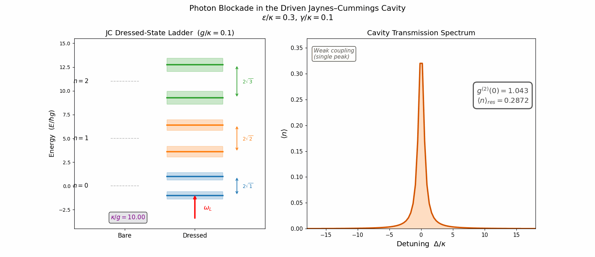
</p>

The transition from weak to strong coupling as $g/\kappa$ is swept from 0.1 to 12. **Left:** Energy-level diagram of the first three JC manifolds ($n = 0, 1, 2$) in units of $\hbar g$, with linewidth bands (shaded) that visibly shrink as $\kappa/g$ decreases. A red arrow marks the coherent drive; the red ✗ marks the blocked second-photon transition once the anharmonic splitting exceeds the linewidth. **Right:** Cavity transmission spectrum $\langle n \rangle(\Delta)$ computed from the steady-state Lindblad equation at each $g/\kappa$. At weak coupling ($g \ll \kappa$), the spectrum is a single Lorentzian centered at $\Delta = 0$ — the atom is too weakly coupled to modify the cavity response. As $g$ crosses $\kappa$, the peak broadens and flattens. At $g/\kappa \gtrsim 2$, the spectrum splits into two resolved peaks at $\Delta = \pm g$ — the **vacuum Rabi doublet**, the spectroscopic signature of strong coupling. The splitting grows as $2g$ (red annotation), directly mirroring the dressed-state gap in the energy ladder. Numerical readouts track the on-resonance $g^{(2)}(0)$ (dropping from ~1 to deep antibunching) and $\langle n \rangle_\text{res}$ (suppressed by the blockade).

---

## Static Figures

### Dressed-State Avoided Crossing and $\sqrt{n+1}$ Scaling

<p align="center">
  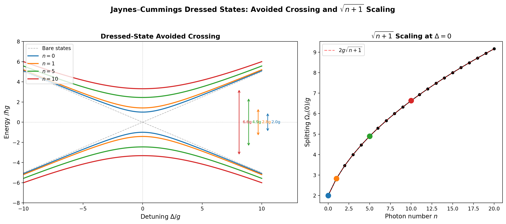
</p>

**Left:** Dressed-state energy eigenvalues $E_{n,\pm}$ as a function of detuning $\Delta/g$ for photon manifolds $n = 0$ (blue), $1$ (orange), $5$ (green), $10$ (red). At resonance ($\Delta = 0$), each manifold exhibits an avoided crossing with splitting $\Omega_n(0) = 2g\sqrt{n+1}$, indicated by colored arrows. **Right:** On-resonance splitting $\Omega_n(0)/g$ vs photon number $n$ (black dots), overlaid with the analytic curve $2\sqrt{n+1}$ (dashed pink). The $\sqrt{n+1}$ dependence is the quantum-mechanical fingerprint of the quantized field: a classical drive would produce a splitting independent of intensity.

### Photon Number Distribution at Six Key Times

<p align="center">
  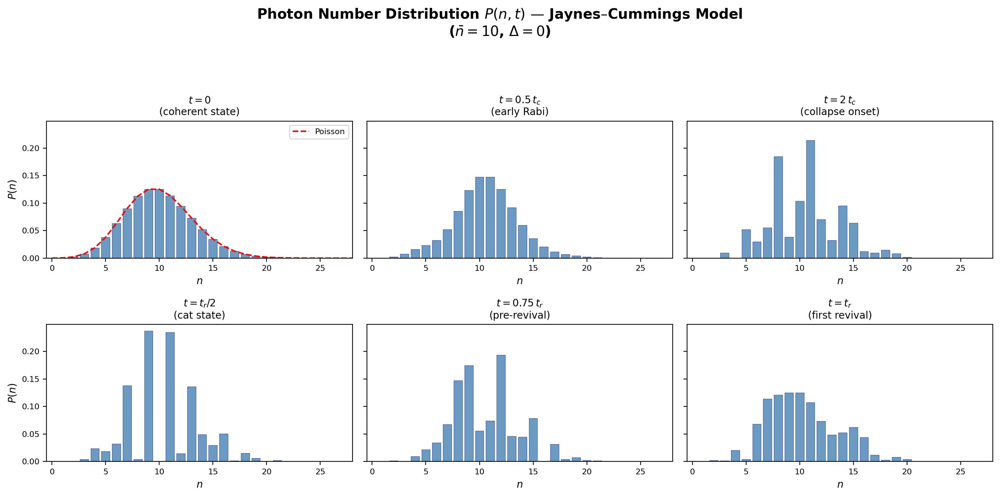
</p>

Snapshots of the intracavity photon number distribution $P(n,t)$ at six characteristic times during JC evolution ($\bar{n} = 10$, $\Delta = 0$). **(a)** $t = 0$: initial Poissonian distribution. **(b)** $t = 0.5\,t_c$: early Rabi oscillations, still approximately unimodal. **(c)** $t = 2\,t_c$: collapse onset, broadening as different Fock components oscillate at incommensurate $\sqrt{n+1}$ frequencies. **(d)** $t = t_r/2$ (cat state): bimodal structure with peaks separated by $\sim 2\sqrt{\bar{n}} \approx 6$ photons. **(e)** $t = 0.75\,t_r$: partial recombination. **(f)** $t = t_r$ (first revival): partially recovered unimodal shape, broader than the initial Poissonian.

### Bloch Sphere Dynamics of the Reduced Atomic State

<p align="center">
  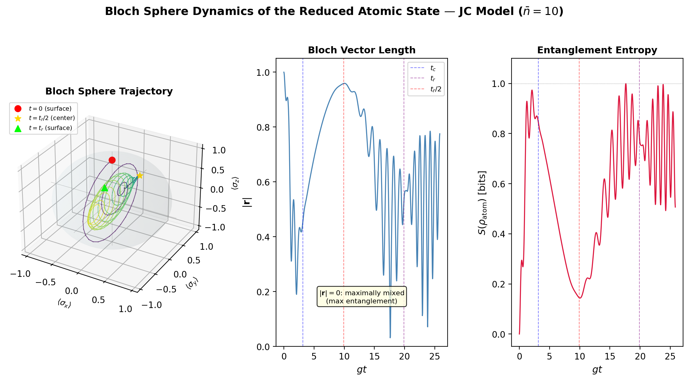
</p>

**Left:** 3D trajectory of the reduced atomic Bloch vector $\mathbf{r} = (\mathrm{Tr}[\rho_\text{atom}\sigma_x],\, \mathrm{Tr}[\rho_\text{atom}\sigma_y],\, \mathrm{Tr}[\rho_\text{atom}\sigma_z])$ during one full collapse-revival cycle. The atom starts at the excited state (red dot, $|\mathbf{r}| = 1$), spirals inward to the origin at $t = t_r/2$ (gold star, maximally mixed / maximally entangled), and partially re-emerges at $t = t_r$ (green triangle). **Center:** Bloch vector length $|\mathbf{r}|(t)$. **Right:** Von Neumann entropy $S(\rho_\text{atom})$. Vertical dashed lines mark $t_c$ (blue), $t_r/2$ (pink), and $t_r$ (purple).

### Wigner vs Husimi Q-Function Comparison

<p align="center">
  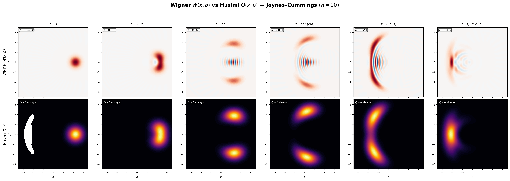
</p>

Side-by-side snapshots at seven characteristic times. Each Wigner panel is annotated with the negativity volume $\delta$. At $t = t_r/2$, the Wigner function exhibits oscillatory fringes with $\delta = 0.85$, while the Q-function shows only two smooth, positive peaks. At $t = t_r$, residual negativity ($\delta = 0.31$) reflects imperfect refactorization.

### Cat-State Survival Phase Diagram

<p align="center">
  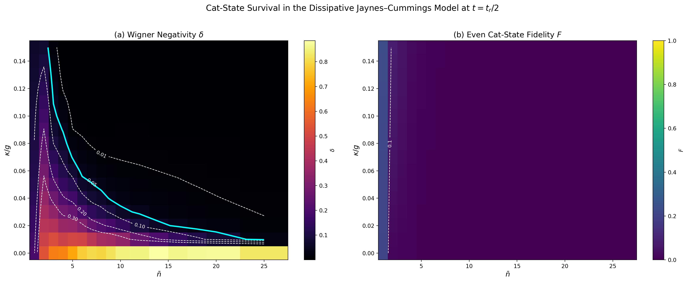
</p>

Systematic 2D parameter sweep (16 × 16 = 256 independent Lindblad simulations) mapping cat-state survival in the $(\bar{n},\, \kappa/g)$ plane at $t = t_r/2$. **(a)** Wigner negativity volume $\delta(\bar{n}, \kappa/g)$. The cyan contour marks $\delta = 0.05$ — the practical boundary below which cat-state interference fringes are unobservable. At $\kappa = 0$, negativity grows with $\bar{n}$ (more photons → sharper fringes → more negative Wigner values). Any nonzero $\kappa$ destroys the cat state, with the critical decay rate scaling as $\kappa_\text{crit} \sim g / \bar{n}$ — the decoherence rate is $\kappa\bar{n}$, not $\kappa$. **(b)** Fidelity $F = \langle\text{cat}^+|\rho_\text{field}|\text{cat}^+\rangle$ against the ideal even cat state $|\text{cat}^+\rangle = \mathcal{N}(|\alpha\rangle + |-\alpha\rangle)$. High fidelity is concentrated at small $\bar{n}$ and small $\kappa/g$, confirming that the JC interaction produces near-ideal cat states only in the few-photon regime where the rotating-wave approximation is excellent.

### Cat-State Survival: Parameter Slices

<p align="center">
  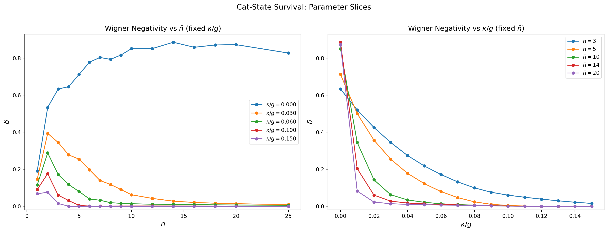
</p>

1D slices through the phase diagram. **Left:** $\delta$ vs $\bar{n}$ at fixed $\kappa/g$. Without dissipation ($\kappa = 0$, blue), negativity grows monotonically with $\bar{n}$ and saturates near $\delta \approx 0.9$ for $\bar{n} \gtrsim 15$. Even modest decay ($\kappa/g = 0.03$, orange) limits the useful range to $\bar{n} \lesssim 5$. The horizontal grey line marks $\delta = 0.05$. **Right:** $\delta$ vs $\kappa/g$ at fixed $\bar{n}$. The decay is approximately exponential, with the $1/e$ decay point scaling as $\kappa_{1/e} \propto g / \bar{n}$ — directly confirming the enhanced decoherence rate of macroscopic superpositions.

### Photon Blockade: $g^{(2)}(0)$ vs Coupling Strength

<p align="center">
  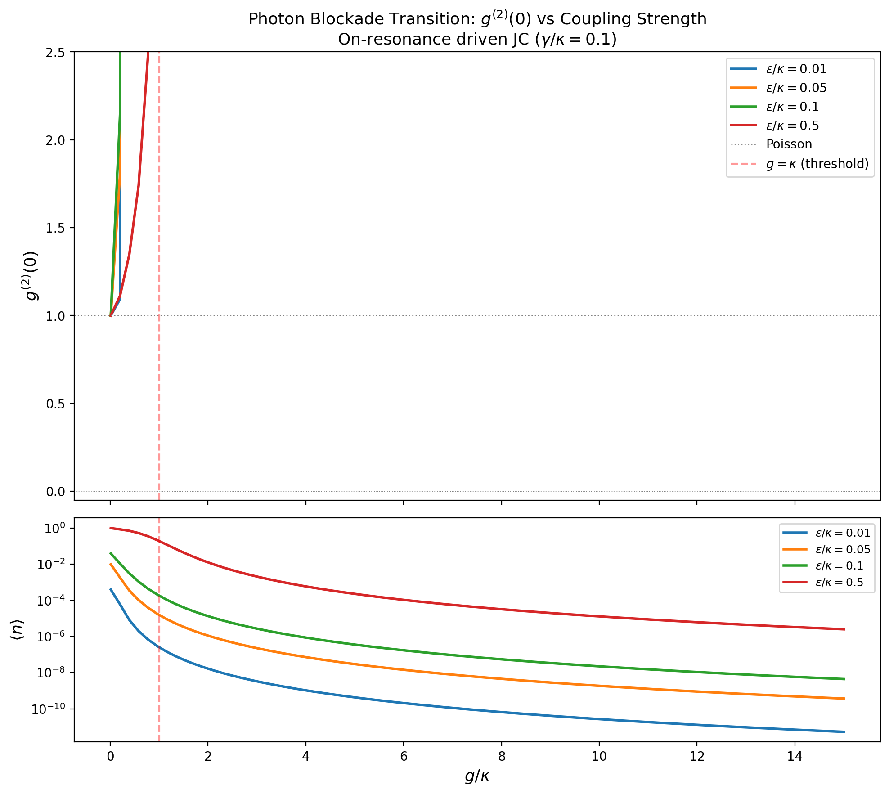
</p>

Equal-time second-order coherence $g^{(2)}(0)$ of the intracavity field as a function of the vacuum Rabi coupling $g/\kappa$, for several drive amplitudes $\varepsilon/\kappa$. At weak coupling ($g \ll \kappa$), the cavity acts as a passive filter and $g^{(2)}(0) \to 2$ (thermal statistics). As $g$ increases past $g \approx \kappa$ (strong-coupling threshold, red dashed line), the photon blockade mechanism activates: the anharmonic JC ladder prevents simultaneous absorption of two photons, driving $g^{(2)}(0) \to 0$. Weaker drives produce deeper antibunching because the blockade condition requires $\varepsilon \ll g$. **Bottom:** Mean intracavity photon number $\langle n \rangle$ — the blockade is accompanied by a dramatic suppression of transmission.

### Photon Statistics vs Drive Strength

<p align="center">
  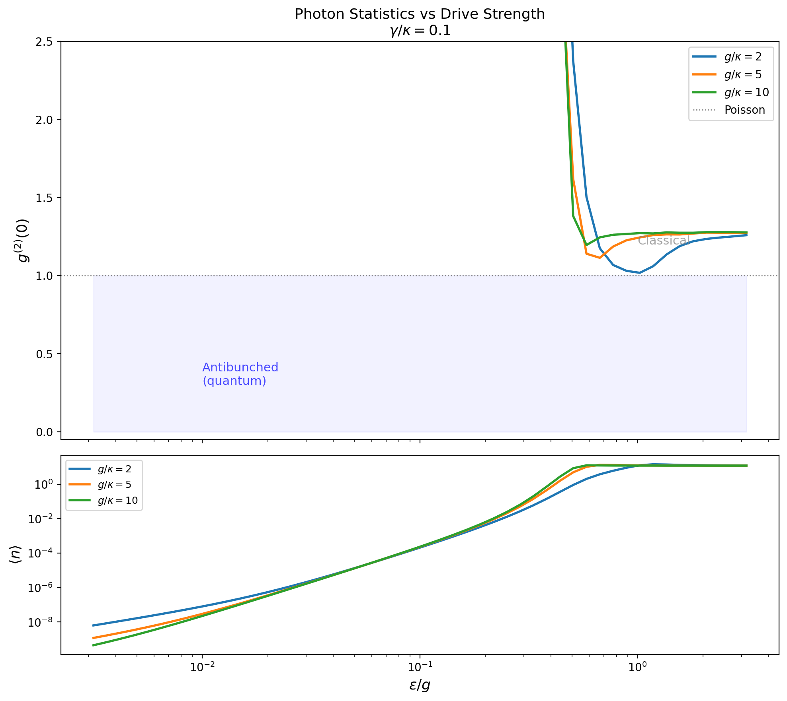
</p>

$g^{(2)}(0)$ as a function of drive strength $\varepsilon/g$ for several values of $g/\kappa$. At weak drive ($\varepsilon \ll g$), the photon blockade suppresses multi-photon occupation and $g^{(2)}(0) \ll 1$ (antibunched / sub-Poissonian). As the drive increases and overcomes the blockade, $g^{(2)}(0)$ rises through 1 (Poissonian) and can exceed 1 (bunched / super-Poissonian) before settling back toward the classical limit. Stronger coupling ($g/\kappa = 10$, green) maintains antibunching to higher drive powers.

### Photon Blockade Spectrum

<p align="center">
  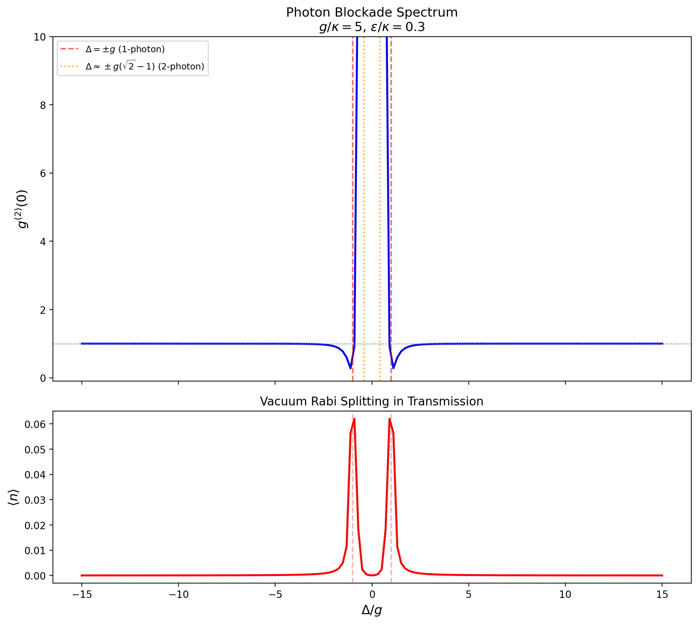
</p>

**Top:** $g^{(2)}(0)$ as a function of laser-cavity detuning $\Delta/g$ for $g/\kappa = 5$. At the dressed-state resonances $\Delta = \pm g$ (red dashed lines), the drive is resonant with the $|0\rangle \to |1,\pm\rangle$ transitions, producing peaks in $\langle n \rangle$ but also sharp structure in $g^{(2)}(0)$. Between the two polariton peaks, the photon blockade produces a deep antibunching dip ($g^{(2)}(0) \ll 1$). The 2-photon resonance condition $\Delta \approx \pm g(\sqrt{2} - 1)$ (orange dashed lines) marks where two-photon absorption becomes possible, creating localized bunching features. **Bottom:** Vacuum Rabi doublet in the cavity transmission spectrum $\langle n \rangle(\Delta)$ — the splitting of $2g$ is the spectroscopic signature of strong coupling.

### $g^{(2)}$ Combined Summary

<p align="center">
  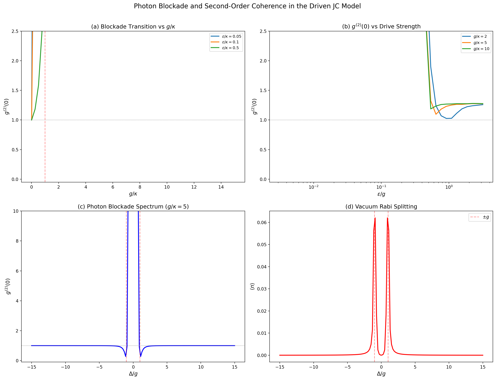
</p>

Four-panel summary of photon blockade physics: **(a)** blockade transition vs $g/\kappa$, **(b)** quantum-to-classical crossover vs drive strength, **(c)** blockade spectrum, **(d)** vacuum Rabi splitting in transmission.

### Cat-State Detail

<p align="center">
  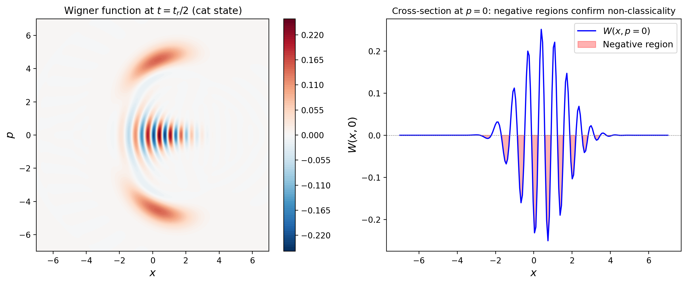
</p>

Cross-section $W(x, p{=}0)$ through the Wigner function at the cat-state time $t = t_r/2$. Deep negative fringes reach $W \sim -0.22$, with fringe spacing $\sim \pi / \sqrt{2\bar{n}} \approx 0.7$.

### Entanglement Across Field States

<p align="center">
  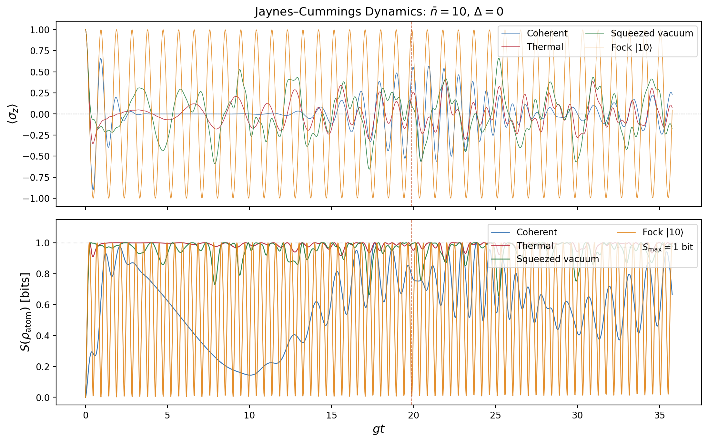
</p>

Von Neumann entanglement entropy $S(\rho_\text{atom})$ for four initial field states with $\bar{n} = 10$. **Coherent** (blue): clean collapse to ~1 bit followed by a revival dip at $t_r$. **Fock** (orange): periodic oscillations at $2g\sqrt{n+1}$. **Thermal** (green): permanent saturation — no revival. **Squeezed** (red): intermediate. Only the coherent state supports rephasing for revivals.

### Entropy Scaling with Photon Number

<p align="center">
  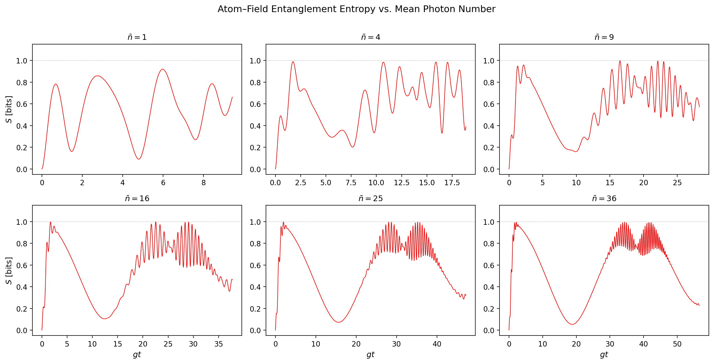
</p>

The collapse time $t_c \sim 1/g$ is independent of $\bar{n}$, while $t_r = 2\pi\sqrt{\bar{n}}/g$ scales as $\sqrt{\bar{n}}$. Clean collapse-revival structure emerges for $\bar{n} \geq 9$.

### Dissipative Entanglement

<p align="center">
  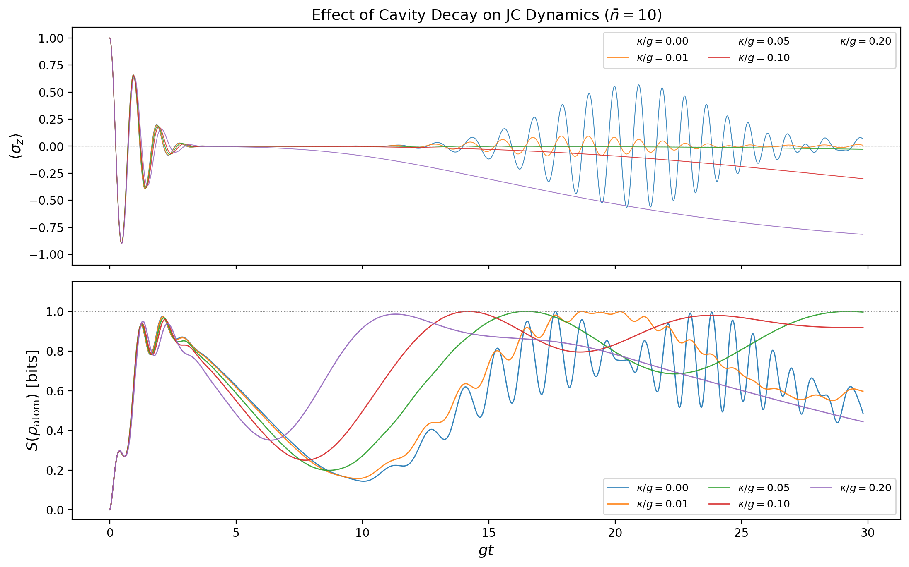
</p>

Effect of cavity dissipation on atom-field entanglement. By $\kappa/g = 0.05$ the revival is absent entirely.

### Decoherence Table

| $\kappa/g$ | Wigner negativity $\delta$ | Field purity | Cat state visible? |
|-----------|--------------------------|--------------|-------------------|
| 0.00      | 0.425                    | 0.960        | Yes               |
| 0.02      | 0.071                    | 0.460        | Marginal          |
| 0.05      | 0.011                    | 0.418        | No                |
| 0.10      | < 0.001                  | 0.386        | No                |

### Coherent vs Thermal Inversion

<p align="center">
  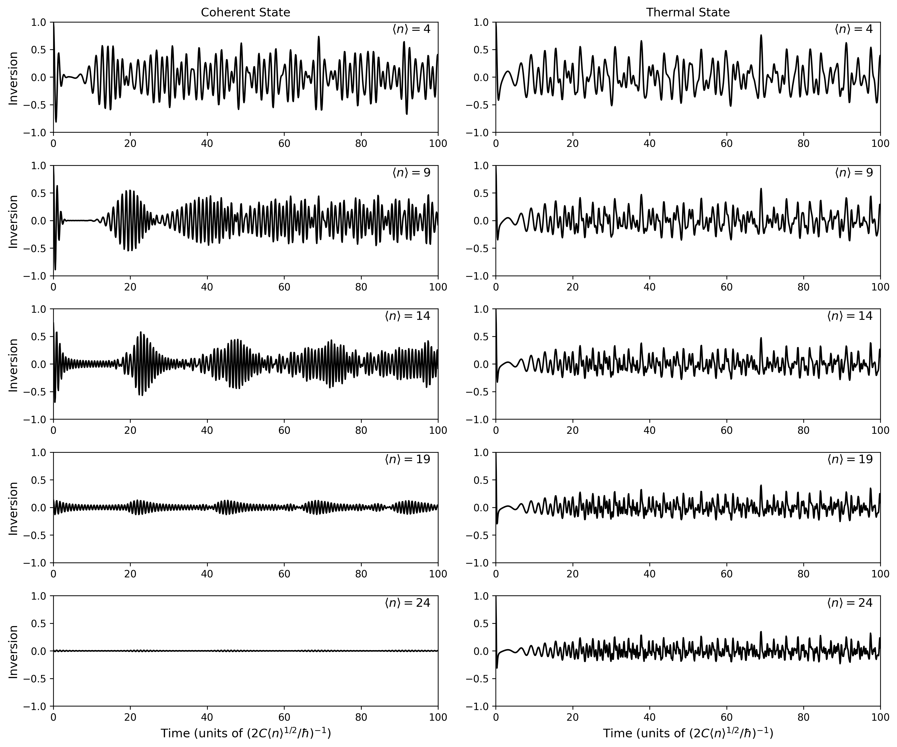
</p>

Atomic inversion $\langle\sigma_z\rangle(t) = \sum_n P(n)\cos(2g\sqrt{n{+}1}\,t)$ for coherent (Poisson) and thermal (Bose-Einstein) initial fields at $\bar{n} = 10$.

### Mollow Triplet

<p align="center">
  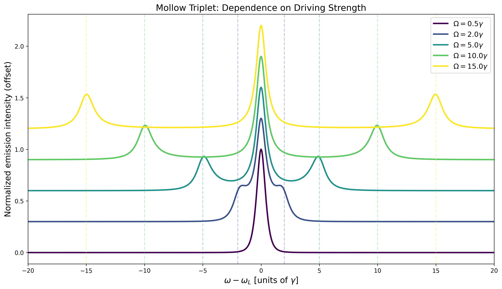
</p>

Resonance fluorescence spectrum via the quantum regression theorem. Sidebands at $\pm\Omega$ with HWHM $= 3\gamma/4$, peak ratio 3:1.

### Static Wigner Functions for Fock States

<p align="center">
  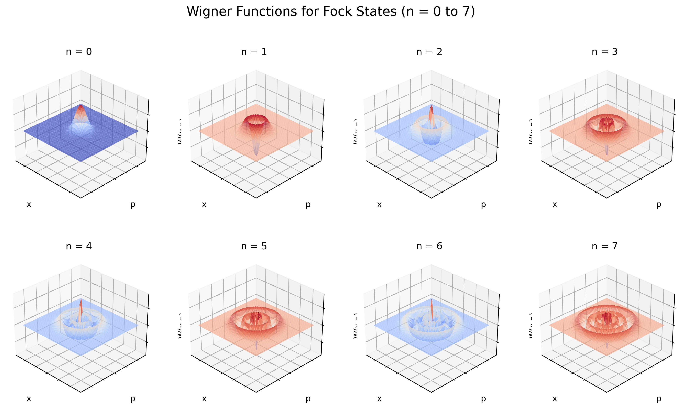
</p>

$W_n(x,p) = \frac{(-1)^n}{\pi} L_n(2r^2) e^{-r^2}$ for Fock states $|n\rangle$. Ring structure and negativity grow with $n$.

---

## Extended Theory

> **Note:** The full theoretical framework — JC Hamiltonian derivation, rotating-wave approximation, dressed states and eigenvalues, collapse and revival timescales, Wigner function formalism, Lindblad master equation, and von Neumann entropy — is presented in the [companion paper](paper/qsol_cqed.pdf) (Sections II–III). The sections below cover **new theoretical material** developed for the extended computational results in this repository.

### 1. Husimi Q-Function and the Phase-Space Smoothing Theorem

The Husimi Q-function is defined as the diagonal matrix element of the density operator in the coherent-state basis:

$$Q(\alpha) = \frac{1}{\pi}\langle\alpha|\rho|\alpha\rangle$$

Since $\rho$ is a positive operator and $|\alpha\rangle$ is a normalized state, it follows immediately that $Q(\alpha) \geq 0$ for all $\alpha$. This is in sharp contrast to the Wigner function, which can take negative values.

The precise relationship between $Q$ and $W$ is given by the **Gaussian convolution theorem**: writing $\alpha = x_\alpha + ip_\alpha$ in phase-space coordinates,

$$Q(x_\alpha, p_\alpha) = \frac{2}{\pi}\int\!\!\int W(x', p')\,\exp\!\left[-2\left((x' - x_\alpha)^2 + (p' - p_\alpha)^2\right)\right]dx'\,dp'$$

The convolution kernel is a Gaussian of variance $\sigma^2 = 1/4$ in each quadrature — precisely the vacuum-state Wigner function $W_{|0\rangle}(x,p) = \frac{1}{\pi}e^{-(x^2 + p^2)}$. In other words, $Q$ is obtained by **smoothing $W$ with a minimum-uncertainty Gaussian** of width equal to the vacuum fluctuation.

This smoothing has an irreversible information-theoretic consequence. Any phase-space feature of $W$ with a spatial frequency above $k_\text{max} \sim 1/\sigma = 2$ is exponentially attenuated. For a Schrödinger cat state with coherent-component separation $2|\alpha|$, the interference fringes in the Wigner function have spatial frequency $k_\text{fringe} = 2|\alpha|$. The ratio $k_\text{fringe}/k_\text{max} = |\alpha|$ determines the suppression factor: the fringes are damped by $\exp(-|\alpha|^2/2)$ in the Q-function. For $\bar{n} = |\alpha|^2 = 10$, this is a suppression of $e^{-5} \approx 0.007$, explaining why the Q-function shows two smooth blobs while the Wigner function resolves detailed oscillatory structure (as demonstrated in our Wigner vs Q comparison figures).

This can also be understood information-theoretically through the **Wehrl entropy** $h_W = -\int Q(\alpha)\ln Q(\alpha)\,d^2\alpha$, which satisfies the Lieb bound $h_W \geq 1$, with equality only for coherent states. The Wehrl entropy is always larger than the von Neumann entropy, $h_W \geq S(\rho) + 1$, with the gap quantifying the information lost by the Gaussian smoothing.

The practical implication is that **Wigner negativity, not Q-function structure, is the correct witness of quantum coherence in phase space.** The Q-function is useful for visualization but fundamentally cannot distinguish a quantum cat state $|\alpha\rangle + |-\alpha\rangle$ from a classical mixture $|\alpha\rangle\langle\alpha| + |-\alpha\rangle\langle-\alpha|$.

### 2. Schrödinger Cat-State Wigner Function and Fidelity

At time $t = t_r/2$, the JC interaction produces a cavity field state that closely approximates an even cat state. The ideal even cat state and its normalization are

$$|\text{cat}^+\rangle = \mathcal{N}_+\bigl(|\alpha\rangle + |-\alpha\rangle\bigr), \qquad \mathcal{N}_+ = \frac{1}{\sqrt{2(1 + e^{-2|\alpha|^2})}}$$

The Wigner function of this state decomposes exactly into three terms:

$$W_\text{cat}(x,p) = \frac{\mathcal{N}_+^2}{2}\Bigl[W_\alpha(x,p) + W_{-\alpha}(x,p)\Bigr] + \mathcal{N}_+^2\,W_\text{int}(x,p)$$

where $W_\alpha$ and $W_{-\alpha}$ are the Gaussian Wigner functions of the two coherent components, and the **interference term** is

$$W_\text{int}(x,p) = \frac{1}{\pi}\cos\!\bigl(4\,p\,\mathrm{Re}\,\alpha\bigr)\,e^{-(x^2 + p^2)}$$

for $\alpha$ real. This interference term is responsible for the oscillatory fringes between the two lobes and is the sole source of Wigner negativity. The fringe spacing in the $p$-direction is

$$\Delta p_\text{fringe} = \frac{\pi}{2\,\mathrm{Re}\,\alpha} = \frac{\pi}{2\sqrt{\bar{n}}}$$

which for $\bar{n} = 10$ gives $\Delta p \approx 0.50$. In the $x$-direction (along the cross-section $W(x, p{=}0)$), the fringes are determined by the overlap of the two Gaussian tails, with spacing $\Delta x \approx \pi/\sqrt{2\bar{n}} \approx 0.70$, consistent with our simulation result.

The maximum negative value of $W_\text{int}$ at the origin is $W_\text{int}(0,0) = -1/\pi$ when $4\cdot 0 \cdot \mathrm{Re}\,\alpha$ produces $\cos = -1$ (which occurs at $p = \pi/(4\mathrm{Re}\,\alpha)$). In practice, the Gaussian envelope $e^{-p^2}$ modulates this, giving the observed minimum $W \approx -0.22$ at $\bar{n} = 10$.

A key result is that **larger cat states have finer fringes.** Since $\Delta p \propto 1/\sqrt{\bar{n}}$, the fringe frequency grows with $\bar{n}$, making the interference pattern increasingly vulnerable to any smoothing process — whether instrumental (finite detector resolution) or physical (decoherence). This is the phase-space manifestation of the fragility of macroscopic superpositions.

We quantify the quality of the dynamically generated cat state using the **fidelity** against the ideal even cat:

$$F(\bar{n}, \kappa/g) = \langle\text{cat}^+|\,\rho_\text{field}(t_r/2)\,|\text{cat}^+\rangle$$

Our phase diagram shows that $F > 0.5$ is achievable only for $\bar{n} \lesssim 4$ at $\kappa = 0$. The fidelity is low even without dissipation at large $\bar{n}$ because the JC interaction does not produce a perfect cat state — the anharmonic $\sqrt{n+1}$ spectrum introduces phase errors that grow with the width of the photon-number distribution.

### 3. Microscopic Derivation of Enhanced Decoherence

The paper cites the decoherence rate $\Gamma_\text{dec} \sim \kappa\bar{n}$ following Zurek [22]. Here we derive it explicitly from the Lindblad dynamics.

Consider the master equation $\dot{\rho} = \kappa\mathcal{D}[a]\rho$ acting on the cavity field alone (ignoring the atom for this argument). We wish to compute the decay rate of the off-diagonal coherence $\langle\alpha|\rho|-\alpha\rangle$ between two coherent states separated by $2\alpha$ in phase space.

Using the coherent-state matrix elements of the Lindblad superoperator, and the eigenvalue relation $a|\alpha\rangle = \alpha|\alpha\rangle$:

$$\frac{d}{dt}\langle\alpha|\rho|-\alpha\rangle = \kappa\left[\alpha(-\alpha)^* - \frac{|\alpha|^2 + |-\alpha|^2}{2}\right]\langle\alpha|\rho|-\alpha\rangle$$

$$= \kappa\left[-|\alpha|^2 - |\alpha|^2\right]\langle\alpha|\rho|-\alpha\rangle = -2\kappa|\alpha|^2\,\langle\alpha|\rho|-\alpha\rangle$$

This gives the exact result:

$$\langle\alpha|\rho(t)|-\alpha\rangle = \langle\alpha|\rho(0)|-\alpha\rangle\,\exp\!\left(-2\kappa|\alpha|^2\,t\right)$$

The decoherence rate is therefore

$$\boxed{\Gamma_\text{dec} = 2\kappa|\alpha|^2 = 2\kappa\bar{n}}$$

This is a factor of $2\bar{n}$ faster than the energy decay rate $\kappa$. The physical interpretation is that each photon lost from the cavity carries "which-component" information about the cat state: a measurement of the photon's phase would distinguish $|\alpha\rangle$ from $|-\alpha\rangle$. The rate of such information leakage is proportional to the photon number.

The **decoherence time** is

$$t_\text{dec} = \frac{1}{2\kappa\bar{n}}$$

For the cat state to be observable, we need $t_\text{dec} \gtrsim t_r/2$, i.e., the cat must survive long enough to form. This requires

$$\frac{1}{2\kappa\bar{n}} \gtrsim \frac{\pi\sqrt{\bar{n}}}{g} \qquad \Longrightarrow \qquad \frac{\kappa}{g} \lesssim \frac{1}{2\pi\bar{n}^{3/2}}$$

For $\bar{n} = 10$, this gives $\kappa/g \lesssim 0.005$, consistent with the $\delta = 0.05$ contour in our phase diagram lying near $\kappa/g \approx 0.01$ at $\bar{n} = 10$. The approximate $\kappa_\text{crit} \propto \bar{n}^{-3/2}$ scaling (combining the $\bar{n}$-dependent decoherence rate with the $\bar{n}^{1/2}$-dependent formation time) is steeper than the naive $\propto 1/\bar{n}$ estimate, reflecting the double penalty of requiring both a longer formation time and surviving faster decoherence.

### 4. Second-Order Coherence and the Photon Blockade Effect

The equal-time second-order correlation function is defined as

$$g^{(2)}(0) = \frac{\langle a^\dagger a^\dagger a\,a\rangle}{\langle a^\dagger a\rangle^2} = \frac{\langle \hat{n}(\hat{n}-1)\rangle}{\langle \hat{n}\rangle^2} = 1 + \frac{\mathrm{Var}(\hat{n}) - \langle\hat{n}\rangle}{\langle\hat{n}\rangle^2}$$

This classifies photon statistics:

| $g^{(2)}(0)$ | Statistics | Physical meaning |
|:---:|:---:|:---|
| $0$ | Perfect antibunching | At most one photon present (single-photon source) |
| $< 1$ | Sub-Poissonian | Photon-number variance below shot noise |
| $= 1$ | Poissonian | Coherent-state (laser) statistics |
| $= 2$ | Thermal (chaotic) | Bose-Einstein bunching |
| $> 2$ | Super-thermal | Exotic multi-photon correlations |

The connection to the paper's Sec. V is that sub-Poissonian statistics ($g^{(2)}(0) < 1$) and photon antibunching are among the definitive criteria for non-classical light. Here we develop the full theory of how the JC nonlinearity produces antibunching via the photon blockade.

#### The Driven Dissipative JC Model

Adding a coherent drive of amplitude $\varepsilon$ at frequency $\omega_L$ and moving to the rotating frame:

$$H_\text{driven} = \Delta_c\,a^\dagger a + \frac{\Delta_a}{2}\sigma_z + g\bigl(a^\dagger\sigma^- + a\,\sigma^+\bigr) + \varepsilon\bigl(a^\dagger + a\bigr)$$

where $\Delta_c = \omega_c - \omega_L$ and $\Delta_a = \omega_a - \omega_L$. The steady state $\rho_\text{ss}$ is found from the Lindblad equation $0 = -i[H, \rho_\text{ss}] + \kappa\mathcal{D}[a]\rho_\text{ss} + \gamma\mathcal{D}[\sigma^-]\rho_\text{ss}$, and $g^{(2)}(0)$ is computed directly from $\rho_\text{ss}$.

#### The Blockade Mechanism

The photon blockade arises from the **anharmonicity of the JC energy ladder**. On resonance ($\Delta_c = \Delta_a = 0$), the dressed-state energies (from the paper's Eq. 14) give transition frequencies:

$$\omega_{0 \to 1,\pm} = \omega_c \pm g \qquad \text{(first photon)}$$

$$\omega_{1,\pm \to 2,\pm} = \omega_c \pm g(\sqrt{2} - 1) \quad \text{or} \quad \omega_c \pm g(2 - \sqrt{2}) \qquad \text{(second photon)}$$

The energy cost of the first photon differs from the second by

$$\delta E_\text{block} = \hbar g\bigl(2 - \sqrt{2}\bigr) \approx 0.59\,\hbar g$$

A drive laser tuned to the first transition (say $\omega_L = \omega_c - g$) is therefore **detuned from the second transition** by $\delta E_\text{block}/\hbar$. If this detuning exceeds the dressed-state linewidth ($\sim \kappa$), the second photon cannot be absorbed while the first is still in the cavity. This is the photon blockade.

The blockade condition is:

$$\frac{g(2 - \sqrt{2})}{\kappa} \gg 1 \qquad \Longleftrightarrow \qquad \frac{g}{\kappa} \gg \frac{1}{2 - \sqrt{2}} \approx 1.71$$

In practice, our simulations show that $g^{(2)}(0) < 0.1$ requires $g/\kappa \gtrsim 5$ at weak drive ($\varepsilon/\kappa = 0.05$), accounting for the finite linewidth and multi-level structure.

#### Drive Strength Crossover

At fixed $g/\kappa$, increasing the drive $\varepsilon$ eventually overwhelms the blockade. In the limit $\varepsilon \gg g$, the cavity is driven classically and $g^{(2)}(0) \to 1$. Our simulations show an intermediate regime where $g^{(2)}(0)$ can exceed 1 (bunching) before settling to the coherent-state value — this occurs because the multi-photon dressed states become populated non-thermally when the drive competes with the nonlinearity.

#### Photon Blockade Spectrum

Sweeping the laser detuning $\Delta$ at fixed $g, \kappa, \varepsilon$ maps out the spectral structure of the blockade. The transmission spectrum $\langle n\rangle(\Delta)$ shows the vacuum Rabi doublet (peaks at $\Delta = \pm g$), while $g^{(2)}(0)(\Delta)$ reveals:

- **Antibunching dips** near $\Delta = 0$, between the two polariton peaks, where the anharmonic detuning $\delta E_\text{block}$ is maximal
- **Bunching spikes** at specific detunings where multi-photon resonances align, particularly near $\Delta = \pm g(\sqrt{2}-1)$ where the two-photon transition $|0\rangle \to |2,\pm\rangle$ becomes resonant

This spectral structure is the fingerprint of the quantized JC ladder and has been directly observed in circuit QED experiments.

### 5. Bloch Vector Dynamics and the Geometry of Entanglement

The reduced atomic state is a $2 \times 2$ density matrix, completely characterized by the Bloch vector:

$$\mathbf{r} = \bigl(\langle\sigma_x\rangle,\, \langle\sigma_y\rangle,\, \langle\sigma_z\rangle\bigr) = \bigl(\mathrm{Tr}[\rho_\text{atom}\sigma_x],\, \mathrm{Tr}[\rho_\text{atom}\sigma_y],\, \mathrm{Tr}[\rho_\text{atom}\sigma_z]\bigr)$$

A pure atomic state lies on the surface of the Bloch sphere ($|\mathbf{r}| = 1$); a maximally mixed state sits at the center ($|\mathbf{r}| = 0$). The Bloch vector length is related to the atomic purity by

$$\mathrm{Tr}[\rho_\text{atom}^2] = \frac{1 + |\mathbf{r}|^2}{2}$$

and to the von Neumann entropy by the binary entropy function:

$$S(\rho_\text{atom}) = h\!\left(\frac{1 + |\mathbf{r}|}{2}\right), \qquad h(p) = -p\log_2 p - (1{-}p)\log_2(1{-}p)$$

This provides a geometric interpretation of entanglement dynamics: **the atom's entanglement with the field is encoded in how far the Bloch vector has retreated from the surface toward the center.** At the collapse time, $|\mathbf{r}|$ drops rapidly from 1 to near 0 as the atom becomes maximally entangled with the field. At the cat-state time $t = t_r/2$, the Bloch vector is at the origin — the atom is in a maximally mixed state, and the field is in a cat state. These are two descriptions of the same physical event: maximal bipartite entanglement.

The trajectory itself is not a simple radial contraction. In 3D, the Bloch vector traces a **spiral** because the coherent Rabi dynamics (rotation about an axis in the $xz$-plane) compete with the dephasing caused by the spread of Fock-state Rabi frequencies. The spiral structure is visible in our Bloch sphere animations: at early times the atom precesses rapidly (Rabi oscillations), while the envelope of the spiral contracts (collapse). The spiral partially re-expands at the revival, but does not return to the surface due to residual entanglement.

### 6. Photon Number Distribution Dynamics and the Number-Space Cat Signature

The photon number distribution $P(n,t) = \langle n|\rho_\text{field}(t)|n\rangle$ provides complementary information to the Wigner function. For the initial state $|e\rangle \otimes |\alpha\rangle$ evolving under the resonant JC Hamiltonian, the reduced field state at time $t$ has diagonal elements

$$P(n,t) = \sum_{m=0}^{\infty} p(m)\left|\langle n|\bigl[\cos(g\sqrt{m{+}1}\,t)|m\rangle\langle m| + \ldots\bigr]|\alpha\rangle\right|^2$$

At $t = 0$, $P(n,0) = e^{-\bar{n}}\bar{n}^n/n!$ (Poisson). At $t = t_r/2$, the conditional dynamics split the distribution into two peaks. This can be understood as follows: at the cat-state time, the field is approximately $|\alpha_+\rangle + |\alpha_-\rangle$ with $\alpha_\pm$ separated by $\sim 2\sqrt{\bar{n}}$ in amplitude. The photon-number distribution of such a superposition is

$$P_\text{cat}(n) \approx \frac{1}{2}\left[P_{\alpha_+}(n) + P_{\alpha_-}(n)\right] + \text{interference}$$

The two Poisson distributions centered at $|\alpha_+|^2$ and $|\alpha_-|^2$ produce the **bimodal structure** visible in our simulations, with peak separation $\sim 2\sqrt{\bar{n}} \approx 6$ photons at $\bar{n} = 10$. The interference terms produce an even-odd oscillation: for an ideal even cat state, only even Fock numbers are populated ($P(n) = 0$ for odd $n$). In the JC-generated cat state, this even-odd asymmetry is approximate but measurable — it provides an experimentally accessible signature of cat-state parity that does not require full Wigner tomography.

At the revival time $t_r$, the distribution partially recombines toward a unimodal shape, but the anharmonicity of the JC spectrum ($\sqrt{n+1}$ rather than linear) prevents perfect recurrence. The distribution at $t = t_r$ is broader and more irregular than the initial Poissonian, with a variance that exceeds $\bar{n}$ — the field has acquired super-Poissonian statistics through its interaction with the atom.

### 7. Cat-State Survival Phase Diagram: Interpretation

The 2D parameter sweep over $(\bar{n}, \kappa/g)$ is the central new computational result. The phase diagram encodes two competing effects:

**Negativity grows with $\bar{n}$ at $\kappa = 0$.** In the ideal (lossless) case, larger $\bar{n}$ produces cat states with sharper interference fringes and larger $\delta$. The negativity saturates near $\delta \approx 0.9$ for $\bar{n} \gtrsim 15$, approaching the ideal even-cat-state value.

**Decoherence accelerates with $\bar{n}$ at $\kappa > 0$.** From Sec. 3, the decoherence rate $\Gamma_\text{dec} = 2\kappa\bar{n}$ grows linearly with $\bar{n}$, while the formation time $t_r/2 = \pi\sqrt{\bar{n}}/g$ grows as $\sqrt{\bar{n}}$. The product $\Gamma_\text{dec} \cdot t_r/2 = 2\pi\kappa\bar{n}^{3/2}/g$ grows as $\bar{n}^{3/2}$, meaning that larger cat states are **exponentially harder to observe** at any fixed nonzero $\kappa$.

The **critical decay rate** for cat-state survival scales as

$$\frac{\kappa_\text{crit}}{g} \sim \frac{C}{\bar{n}^{3/2}}$$

where $C$ is a threshold constant that depends on the observability criterion for $\delta$. Our phase diagram confirms this: the $\delta = 0.05$ contour follows an approximate $\kappa \propto \bar{n}^{-3/2}$ power law, steeper than the naive $1/\bar{n}$.

The parameter slices provide practical design guidance. To observe a cat state with $\delta > 0.05$ at $\bar{n} = 10$, one requires $\kappa/g < 0.02$, i.e., $g/\kappa > 50$. This condition is achievable in microwave cavity QED ($g/\kappa \sim 10^4$) and circuit QED ($g/\kappa \sim 100\text{–}300$), but remains challenging in optical cavities where typical $g/\kappa \sim 1\text{–}10$.

---

## Simulation Details

### Parameters

| Parameter | Symbol | Default |
|-----------|--------|---------|
| Vacuum Rabi coupling | $g$ | 1.0 |
| Mean photon number | $\bar{n}$ | 10 |
| Fock truncation | $N_\text{cav}$ | 35–50 |
| Cavity decay | $\kappa/g$ | 0–0.2 |
| Atom decay | $\gamma/g$ | 0–0.1 |
| Drive amplitude | $\varepsilon/g$ | 0–5 |
| Collapse time | $t_c$ | $\sim 1/g$ |
| Revival time | $t_r$ | $2\pi\sqrt{\bar{n}}/g$ |

### Figure-to-Script Map

| Output | Script |
|--------|--------|
| `fig_avoided_crossing` | `sim_avoided_crossing.py` |
| `fig_photon_number_evolution` | `sim_photon_number_distribution.py` |
| `fig_bloch_sphere_trajectory` | `sim_bloch_sphere.py` |
| `fig_q_vs_wigner` | `sim_q_vs_wigner.py` |
| `fig_phase_diagram` / `fig_phase_combined` / `fig_phase_slices` / `fig_cat_fidelity` | `sim_phase_diagram.py` |
| `fig_g2_vs_coupling` / `fig_g2_vs_drive` / `fig_g2_blockade_spectrum` / `fig_g2_combined` | `sim_g2_coherence.py` |
| `fig_inversion_snapshots` / `fig_wigner_evolution` / `fig_cat_state_detail` / `fig_wigner_decoherence` | `sim_wigner_evolution.py` |
| `fig_entanglement_comparison` / `fig_entropy_nbar_scaling` / `fig_dissipative_entanglement` | `sim_entanglement_dynamics.py` |
| `jaynes_cummings_comparison` | `jaynes_cummings_comparison.py` |
| `mollow_triplet_driving_strength` | `mollow_triplet.py` |
| `wigner_fock_combined` | `wigner_fock_states.py` |
| All `anim_*.gif` | Corresponding `anim_*.py` in `animations/` |
| `anim_phase_diagram.gif` | `anim_phase_diagram.py` |
| `anim_g2_blockade.gif` | `anim_g2_blockade.py` |
| `banner_qsol.png` | `thumbnail_banner.py` |

---

## Repository Structure

```
.
├── paper/
│   ├── merged_paper.tex              # Full manuscript (REVTeX 4.2)
│   └── figures/                      # Static figures (PDF + PNG) + banner
│
├── simulations/
│   ├── utils.py                      # JC operators, initial states, timescales
│   ├── sim_wigner_evolution.py       # Wigner W(x,p) dynamics + decoherence
│   ├── sim_entanglement_dynamics.py  # Von Neumann entropy + purity + scaling
│   ├── sim_avoided_crossing.py       # Dressed-state energy levels + √(n+1)
│   ├── sim_photon_number_distribution.py  # P(n,t) snapshots
│   ├── sim_bloch_sphere.py           # Bloch trajectory + |r|(t) + entropy
│   ├── sim_q_vs_wigner.py            # Wigner vs Husimi Q comparison
│   ├── sim_phase_diagram.py          # δ(n̄, κ/g) + cat fidelity 2D sweep
│   ├── sim_g2_coherence.py           # g⁽²⁾(0) vs coupling, drive, detuning
│   ├── jaynes_cummings_comparison.py # Coherent vs thermal inversion
│   ├── mollow_triplet.py             # Fluorescence spectrum
│   └── wigner_fock_states.py         # Static Wigner functions for Fock states
│
├── animations/
│   ├── anim_wigner_evolution.py      # Wigner evolution (120 frames, 2.6 MB)
│   ├── anim_entanglement.py          # Entropy + Wigner (120 frames, 2.3 MB)
│   ├── anim_decoherence.py           # Decoherence sweep (60 frames, 750 KB)
│   ├── anim_avoided_crossing.py      # Dressed-state sweep (~80 frames, 1.4 MB)
│   ├── anim_photon_number.py         # P(n,t) evolution (~80 frames, 1.5 MB)
│   ├── anim_bloch_sphere.py          # Bloch trajectory (~80 frames, 1.5 MB)
│   ├── anim_q_vs_wigner.py           # W vs Q comparison (80 frames, 4.2 MB)
│   ├── anim_phase_diagram.py         # Cat-state decoherence sweep (40 frames)
│   ├── anim_g2_blockade.py           # Photon blockade transition (50 frames)
│   └── thumbnail_banner.py           # Dark banner image
│
├── figures/                          # New computational figures (PDF + PNG)
│   ├── fig_avoided_crossing.*
│   ├── fig_photon_number_evolution.*
│   ├── fig_bloch_sphere_trajectory.*
│   ├── fig_q_vs_wigner.*
│   ├── fig_phase_diagram.* / fig_phase_combined.* / fig_phase_slices.* / fig_cat_fidelity.*
│   └── fig_g2_vs_coupling.* / fig_g2_vs_drive.* / fig_g2_blockade_spectrum.* / fig_g2_combined.*
│
├── requirements.txt
├── LICENSE
└── README.md
```

---

## Quick Start

```bash
git clone https://github.com/alanknguyen/QSOL_CQED.git
cd QSOL_CQED
pip install -r requirements.txt
```

Static figures:

```bash
cd simulations
python sim_wigner_evolution.py            # ~2 min
python sim_entanglement_dynamics.py       # ~5 min
python sim_avoided_crossing.py            # ~30 sec
python sim_photon_number_distribution.py  # ~1 min
python sim_bloch_sphere.py                # ~2 min
python sim_q_vs_wigner.py                 # ~3 min
python sim_phase_diagram.py              # ~10 min (256-point sweep)
python sim_g2_coherence.py               # ~5 min
python jaynes_cummings_comparison.py      # ~10 sec
python mollow_triplet.py                  # ~1 min
python wigner_fock_states.py              # ~5 sec
```

Animations:

```bash
cd animations
python anim_wigner_evolution.py           # ~5 min
python anim_entanglement.py              # ~5 min
python anim_decoherence.py              # ~3 min
python anim_avoided_crossing.py          # ~2 min
python anim_photon_number.py             # ~3 min
python anim_bloch_sphere.py              # ~3 min
python anim_q_vs_wigner.py              # ~8 min
python anim_phase_diagram.py            # ~5 min
python anim_g2_blockade.py              # ~3 min
python thumbnail_banner.py              # ~30 sec
```

---

## Citation

```bibtex
@article{nguyen2025quantum,
  author  = {Nguyen, Nguyen Khoi},
  title   = {Quantum States of Light in Cavity {QED}: A Computational Study
             of {Wigner} Function Dynamics and Atom-Field Entanglement
             in the {Jaynes-Cummings} Model},
  journal = {arXiv preprint arXiv:XXXX.XXXXX},
  year    = {2025},
}
```

## License

MIT. See [LICENSE](LICENSE).

## Acknowledgments

Prepared under the guidance of Prof. Luca Dal Negro at Boston University (EC 585, EC 777). Simulations use [QuTiP](https://qutip.org/) by J. R. Johansson, P. D. Nation, and F. Nori.