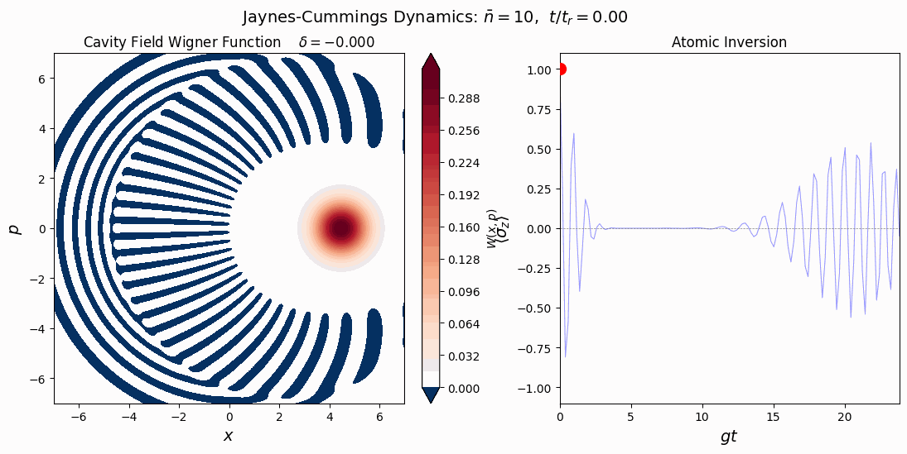
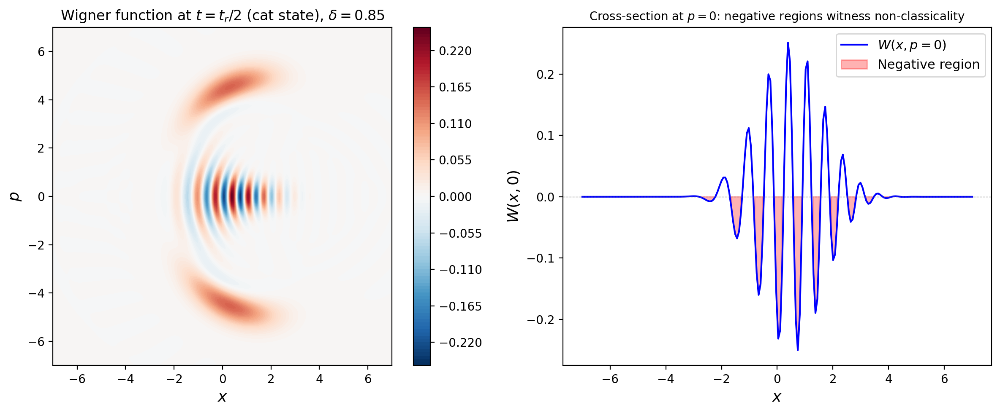
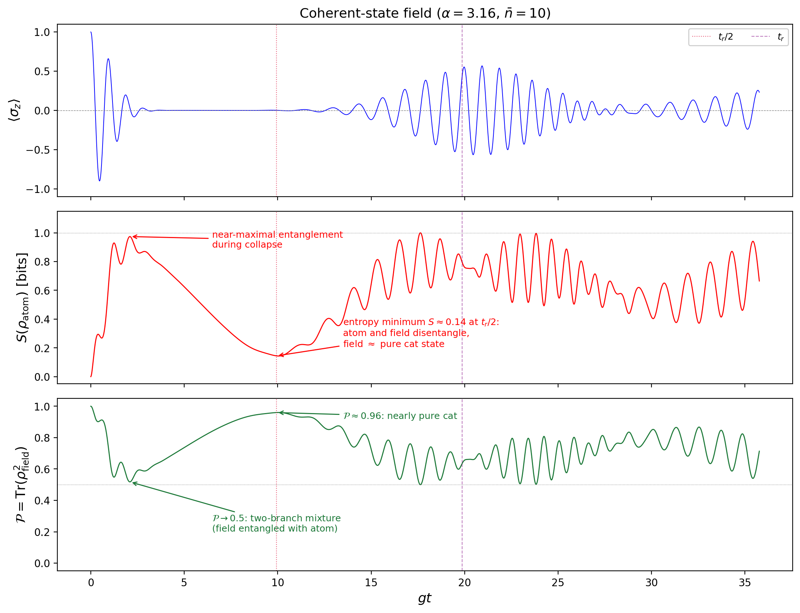
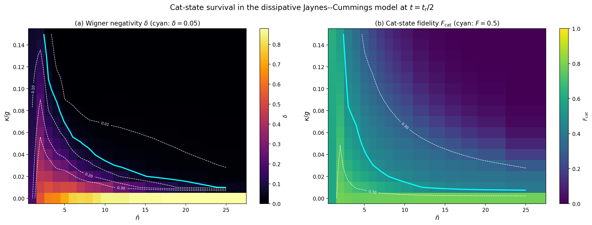

# QSOL_CQED

**Wigner-function dynamics and atom–field entanglement in the Jaynes–Cummings model**

[](LICENSE)
[](https://www.python.org/)
[](https://qutip.org/)
[](https://doi.org/10.5281/zenodo.22806075)

Nguyen Khoi Nguyen, Boston University. Advised by Prof. Luca Dal Negro (EC 585 / EC 777).

<p align="center">
  
</p>

## What this is

QuTiP simulations of a single two-level atom coupled to a single cavity mode (the resonant Jaynes–Cummings model), followed through one collapse–revival cycle with three observables side by side: the Wigner function of the cavity field, the atom–field entanglement, and the effect of cavity loss. Every figure in the accompanying manuscript is produced by a script in `simulations/`, and all quantities were convergence-checked against the Fock-space truncation.

The physics is textbook and classic-literature material (Eberly 1980, Gea-Banacloche 1990–91, Phoenix and Knight 1988–91). The contribution is a verified, reproducible computational route through it with modern metrics: Wigner negativity, logarithmic negativity, and cat-state fidelity.

## Main results (initially excited atom, coherent field, n̄ = 10)

| Quantity | Value |
|---|---|
| Wigner negativity δ of the field at t_r/2 | 0.85 (0.31 at t_r) |
| Field purity at t_r/2 | 0.96 |
| Fidelity to the best two-component cat | 0.78, and independent of n̄ for n̄ = 2–25 |
| Reduced atomic entropy at t_r/2 | 0.14 bit, the minimum of the cycle |
| Thermal field: reduced entropy vs log-negativity | 1.0 bit vs ≈ 0.2 |
| δ after cavity loss κ/g = 0.02 | 0.14 (an 83 % reduction) |
| Cat-survival boundary δ = 0.05 | κ_c/g ≈ 0.46 n̄^−1.14 |
| Photon blockade, drive on the polariton, g/κ = 5 and 10 | g²(0) = 0.11 and 0.03 |

Three points that standard presentations leave implicit:

1. **The cat state coincides with a minimum of entanglement.** During the collapse the atom and field are maximally entangled and the reduced field is a two-branch mixture (purity 0.5). At half the revival time they disentangle and the field is left as a nearly pure cat.
2. **Reduced entropy is an entanglement measure only for pure global states.** A thermal field saturates it at one bit while the logarithmic negativity stays near 0.2.
3. **Cavity loss destroys the cat's internal coherence long before it changes the atom–field entanglement.**

<p align="center">
  <br>
  <em>Cat state at t = t_r/2: two lobes on the p axis and interference fringes reaching W ≈ −0.25.</em>
</p>
<p align="center">
  <br>
  <em>Inversion, atomic entropy and field purity through one collapse–revival cycle.</em>
</p>
<p align="center">
  <br>
  <em>Cat survival in the (n̄, κ/g) plane: Wigner negativity (left) and cat fidelity (right) at t_r/2.</em>
</p>

Captions for all nine animations and every repository figure are in [docs/gallery.md](docs/gallery.md); supplementary derivations are in [docs/extended_theory.md](docs/extended_theory.md).

## Repository layout

```
paper/            qsol_cqed.tex + qsol_cqed.pdf (REVTeX), figures/, ejp/ (IOP journal version)
simulations/      one script per figure group; animation/ holds the GIF generators
figures/          repository-only figures (PNG + PDF) and the .npz sweep data
animations/       nine GIFs
docs/             figure gallery with captions, extended theory notes
```

## Install and run

```bash
git clone https://github.com/alanknguyen/QSOL_CQED.git
cd QSOL_CQED
pip install -r requirements.txt
```

Scripts write to repo-relative paths and can be run from any directory. Timings are for a laptop with QuTiP 5.2.3.

| Script | Produces | Time |
|---|---|---|
| `simulations/sim_wigner_evolution.py` | paper Figs. 1–4 | 10 s |
| `simulations/sim_entanglement_dynamics.py` | paper Figs. 5–8 | 1 min |
| `simulations/jaynes_cummings_comparison.py` | paper Fig. 9 | 5 s |
| `simulations/wigner_quantum_states.py` | paper Figs. 10–11 | 10 s |
| `simulations/mollow_triplet.py` | paper Fig. 12 | 5 s |
| `simulations/sim_phase_diagram.py` | cat-survival phase diagram, `figures/phase_diagram_data.npz` | 2 min |
| `simulations/sim_g2_coherence.py` | photon-blockade figures, `figures/g2_data.npz` | 30 s |
| `simulations/animation/sim_*.py` | avoided crossing, photon-number, Bloch-sphere, Q-vs-Wigner figures and GIFs | 10–20 s each |
| `simulations/animation/anim_*.py` | the remaining GIFs | about 1 min each |

## Reproducibility notes

- **Conventions.** Wigner negativity δ = ∫|W| dx dp − 1 (Kenfack–Życzkowski), which is twice the integrated negative volume. Phase space a = (x + ip)/√2, so ∫W dx dp = 1. Operational collapse time t_c ≡ 1/g; revival time t_r = 2π√n̄/g.
- **Truncation.** Coherent and Fock states use N_cav = 35–50. Thermal and squeezed-vacuum states have heavy photon-number tails and use N_cav = 150; at N_cav = 50 they would have ⟨n⟩ = 9.57 and 9.15 instead of 10.
- **Entanglement.** The reduced-atom entropy is reported for pure global states; the logarithmic negativity E_N = log₂‖ρ^T_atom‖₁ is used whenever the global state is mixed.
- **Cat fidelity** is against the best-fitting two-component cat with branches near ±i√n̄; the JC cat lives on the p axis and is approximately odd, so comparing with the even cat |α⟩ + |−α⟩ on the real axis gives F ≈ 0 and is not meaningful.
- **Photon blockade** sweeps drive the lower polariton (Δ = ω_c − ω_L = g). On bare-cavity resonance in strong coupling the cavity is nearly empty and g²(0) ≫ 1, which is bunching, not blockade.
- **Solver.** QuTiP `mesolve` with the default Adams integrator (atol 1e-8, rtol 1e-6); state vectors for pure unitary runs, density matrices otherwise. Environment: QuTiP 5.2.3, NumPy 2.4, SciPy 1.15, Matplotlib 3.10.

## Paper

- `paper/qsol_cqed.pdf`: manuscript (REVTeX 4.2). Rebuild with `cd paper && tectonic qsol_cqed.tex`.
- `paper/ejp/`: the same article in IOP Publishing's `iopjournal` format for the European Journal of Physics, with submission guidelines.

## Citation

```bibtex
@software{nguyen2026qsolcqed,
  author  = {Nguyen, Nguyen Khoi},
  title   = {QSOL\_CQED: Wigner-function dynamics and atom-field entanglement in the Jaynes-Cummings model},
  year    = {2026},
  version = {1.1.0},
  publisher = {Zenodo},
  doi     = {10.5281/zenodo.22806076},
  url     = {https://doi.org/10.5281/zenodo.22806076}
}
```

The DOI above identifies release v1.1.0, the version behind the manuscript's figures; [10.5281/zenodo.22806075](https://doi.org/10.5281/zenodo.22806075) always resolves to the latest release. See also `CITATION.cff`.

## License and acknowledgments

MIT License. Simulations use [QuTiP](https://qutip.org/) (Johansson, Nation and Nori). Prepared under the guidance of Prof. Luca Dal Negro at Boston University.
