# Quantum States of Light in Cavity QED

## Wigner Function Dynamics and Atom-Field Entanglement in the Jaynes-Cummings Model

<p align="center">
  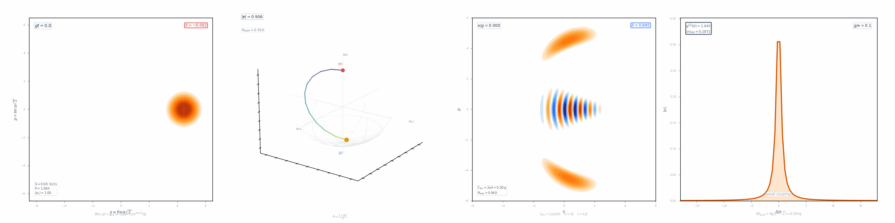
</p>

[](https://arxiv.org/abs/XXXX.XXXXX)
[](LICENSE)
[](https://www.python.org/)
[](https://qutip.org/)
[](https://numpy.org/)
[](https://scipy.org/)
[](https://matplotlib.org/)
[](https://imageio.readthedocs.io/)
[](https://jupyter.org/)
[](https://www.latex-project.org/)
[]()
[ ](https://peps.python.org/pep-0008/)
[]()
[]()
[]()
[]()

Nguyen Khoi Nguyen (Alan), Boston University  
Advised by Prof. Luca Dal Negro, EC 585 / EC 777

---

## Overview

Computational study of quantum light-matter interaction in the Jaynes-Cummings (JC) model. All dynamics are computed from first principles using QuTiP, with no phenomenological approximations.

**Five principal results:**

1. Time-resolved Wigner function snapshots showing Schrödinger cat-state formation at $t = t_r/2$ with Wigner negativity $\delta = 0.85$, field purity $0.96$ and cat fidelity $F_\text{cat} = 0.78$; at this instant the atom and field approximately **disentangle** (reduced atomic entropy $S \approx 0.14$ bit), so the cat is a nearly pure state of the field alone
2. Systematic comparison of atom-field entanglement (reduced entropy and logarithmic negativity) across coherent, thermal, squeezed, and Fock initial field states: the half-revival disentanglement occurs only for the coherent field, and for a thermal field a saturated entropy of 1 bit hides a logarithmic negativity of only $\approx 0.2$
3. Quantitative decoherence study: cavity decay $\kappa/g = 0.02$ reduces cat-state Wigner negativity by over 80%
4. **Cat-state survival phase diagram**: 2D parameter sweep of $\delta(\bar{n}, \kappa/g)$ mapping the boundary of observable quantum coherence, plus the best-fit two-component cat fidelity $F_\text{cat}(\bar{n}, \kappa/g)$
5. **Photon blockade and second-order coherence**: $g^{(2)}(0)$ as a function of coupling strength, drive power, and detuning (drive resonant with a polariton), demonstrating the quantum-to-classical crossover

**Conventions used throughout:** $\delta = \int |W|\,dx\,dp - 1$ (Kenfack–Życzkowski; equal to twice the integrated negative volume), phase space $a = (x + ip)/\sqrt{2}$ (QuTiP default, $\int W\,dx\,dp = 1$), operational collapse time $t_c \equiv 1/g$, revival time $t_r = 2\pi\sqrt{\bar{n}}/g$.

<p align="center">
  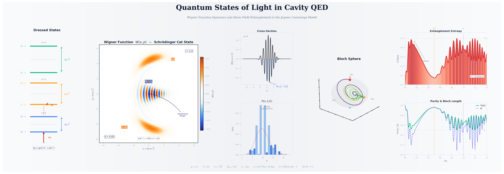
</p>

## Table of Contents

- [Animations](#animations)
  - [Wigner Function Evolution](#wigner-function-evolution)
  - [Entanglement, Inversion, and Purity](#entanglement-inversion-and-purity)
  - [Decoherence Destroys the Cat State](#decoherence-destroys-the-cat-state)
  - [Dressed-State Avoided Crossing](#dressed-state-avoided-crossing)
  - [Photon Number Distribution Dynamics](#photon-number-distribution-dynamics)
  - [Bloch Sphere Trajectory](#bloch-sphere-trajectory)
  - [Wigner vs Husimi Q-Function](#wigner-vs-husimi-q-function)
  - [Cat-State Decoherence Sweep](#cat-state-decoherence-sweep)
  - [Photon Blockade Transition](#photon-blockade-transition)
- [Static Figures](#static-figures)
  - [Dressed-State Avoided Crossing and Scaling](#dressed-state-avoided-crossing-and-sqrtn1-scaling)
  - [Photon Number Distribution at Six Key Times](#photon-number-distribution-at-six-key-times)
  - [Bloch Sphere Dynamics](#bloch-sphere-dynamics-of-the-reduced-atomic-state)
  - [Wigner vs Husimi Q-Function Comparison](#wigner-vs-husimi-q-function-comparison)
  - [Cat-State Survival Phase Diagram](#cat-state-survival-phase-diagram)
  - [Cat-State Survival: Parameter Slices](#cat-state-survival-parameter-slices)
  - [Photon Blockade: g(2) vs Coupling Strength](#photon-blockade-g20-vs-coupling-strength)
  - [Photon Statistics vs Drive Strength](#photon-statistics-vs-drive-strength)
  - [Photon Blockade Spectrum](#photon-blockade-spectrum)
  - [g(2) Combined Summary](#g2-combined-summary)
  - [Cat-State Detail](#cat-state-detail)
  - [Entanglement Across Field States](#entanglement-across-field-states)
  - [Entropy Scaling with Photon Number](#entropy-scaling-with-photon-number)
  - [Dissipative Entanglement](#dissipative-entanglement)
  - [Decoherence Table](#decoherence-table)
  - [Coherent vs Thermal Inversion](#coherent-vs-thermal-inversion)
  - [Mollow Triplet](#mollow-triplet)
  - [Static Wigner Functions for Fock States](#static-wigner-functions-for-fock-states)
- [Extended Theory](#extended-theory)
  - [1. Husimi Q-Function and the Phase-Space Smoothing Theorem](#1-husimi-q-function-and-the-phase-space-smoothing-theorem)
  - [2. Schrodinger Cat-State Wigner Function and Fidelity](#2-schrödinger-cat-state-wigner-function-and-fidelity)
  - [3. Microscopic Derivation of Enhanced Decoherence](#3-microscopic-derivation-of-enhanced-decoherence)
  - [4. Second-Order Coherence and the Photon Blockade Effect](#4-second-order-coherence-and-the-photon-blockade-effect)
  - [5. Bloch Vector Dynamics and the Geometry of Entanglement](#5-bloch-vector-dynamics-and-the-geometry-of-entanglement)
  - [6. Photon Number Distribution Dynamics and the Number-Space Cat Signature](#6-photon-number-distribution-dynamics-and-the-number-space-cat-signature)
  - [7. Cat-State Survival Phase Diagram: Interpretation](#7-cat-state-survival-phase-diagram-interpretation)
- [Simulation Details](#simulation-details)
  - [Parameters](#parameters)
  - [Figure-to-Script Map](#figure-to-script-map)
- [Quick Start](#quick-start)
- [Citation](#citation)
- [License](#license)
- [Acknowledgments](#acknowledgments)

---

## Animations

### Wigner Function Evolution

<p align="center">
  
</p>

A coherent state $|\alpha = \sqrt{10}\rangle$ evolves under the resonant JC Hamiltonian. During the collapse of Rabi oscillations, the intracavity field splits into a superposition of two phase-space components — a Schrödinger cat state. **Left:** Wigner function $W(x,p)$ of the reduced cavity field state $\rho_\text{field} = \mathrm{Tr}_\text{atom}[\rho]$, computed on a 200×200 phase-space grid. Interference fringes between the two coherent components produce negative regions ($W < 0$, blue), the hallmark of non-classicality. **Right:** Atomic inversion $\langle\sigma_z\rangle(t)$ with a moving time marker. The animation pauses at the cat-state time ($t = t_r/2$), where the atom and field approximately **disentangle** and the field is a nearly pure cat (purity 0.96, $\delta = 0.85$), and at the first revival ($t = t_r = 2\pi\sqrt{\bar{n}}/g$), where the branches rephase and the atom and field are strongly entangled again.

### Entanglement, Inversion, and Purity

<p align="center">
  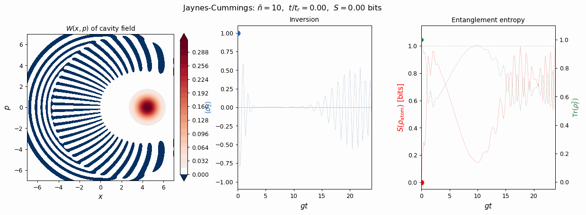
</p>

Simultaneous evolution of three complementary observables. **Left:** Wigner function $W(x,p)$. **Center:** Atomic inversion $\langle\sigma_z\rangle(t)$. **Right:** Von Neumann entanglement entropy $S(\rho_\text{atom})$ (red) and field-state purity $\mathrm{Tr}[\rho_\text{field}^2]$ (green). Entropy rises to 1 bit during the collapse (atom and field maximally entangled) while the field purity drops to ~0.5: the reduced field is then a statistical mixture of two near-orthogonal branches. At $t = t_r/2$ the entropy falls to its minimum ($\approx 0.14$ bit) and the purity peaks at 0.96: the atom and field disentangle and the field is left in a nearly pure cat state. Toward the revival the entanglement grows again ($S \approx 0.8$ bit at $t_r$).

### Decoherence Destroys the Cat State

<p align="center">
  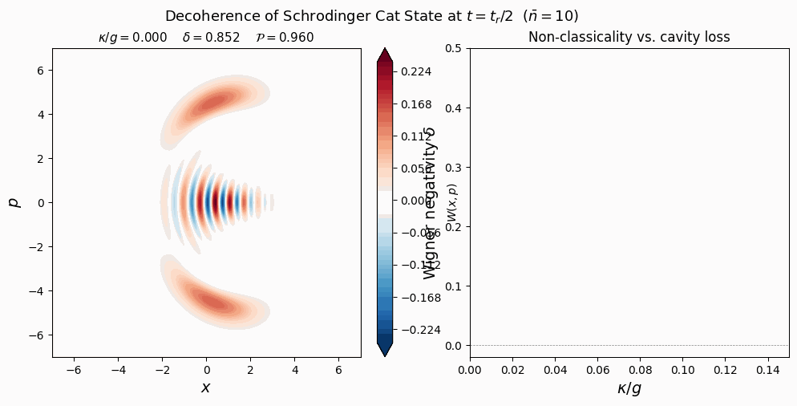
</p>

Cavity photon loss via the Lindblad dissipator $\kappa \mathcal{D}[a]$ erases quantum coherence on a timescale $1/(2\kappa \bar{n})$, far shorter than the bare cavity lifetime $1/\kappa$. **Left:** Wigner function at the cat-state time $t = t_r/2$ as the decay rate $\kappa/g$ increases from 0 to 0.15. The interference fringes vanish first (they involve high-order coherences), while the two Gaussian lobes persist — the state decoheres into a classical mixture. **Right:** Wigner negativity volume $\delta$ tracking the continuous loss of non-classicality.

### Dressed-State Avoided Crossing

<p align="center">
  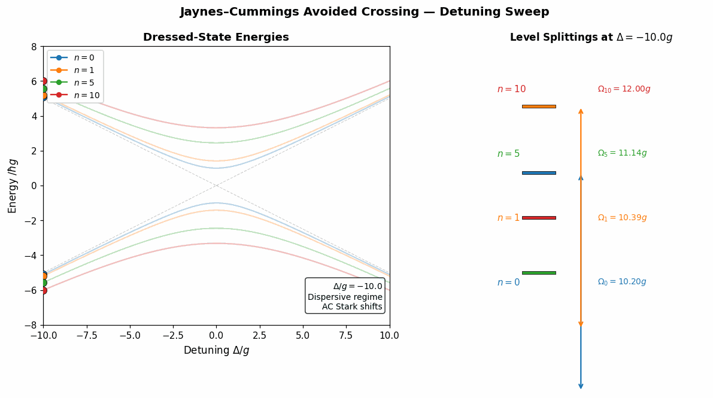
</p>

The JC dressed states $|n, \pm\rangle$ are the exact eigenstates of the coupled atom-cavity system. As the atom-cavity detuning $\Delta = \omega_a - \omega_c$ is swept, the bare-state energies (dashed grey) would cross, but the JC interaction opens an avoided crossing with a gap of $2g\sqrt{n+1}$. This animation sweeps $\Delta/g$ from $-10$ to $+10$ for manifolds $n = 0, 1, 5, 10$ simultaneously, making the $\sqrt{n+1}$ scaling of the vacuum Rabi splitting directly visible. At large detuning the dressed states approach the bare (uncoupled) states; on resonance the hybridization is maximal.

### Photon Number Distribution Dynamics

<p align="center">
  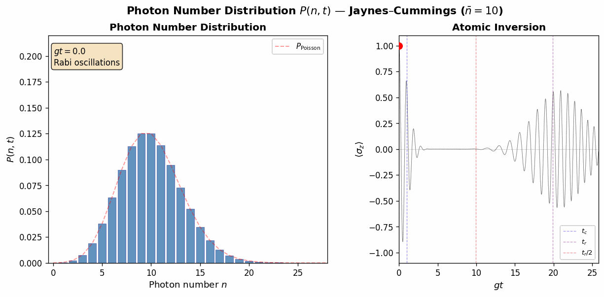
</p>

Time evolution of the intracavity photon number distribution $P(n, t) = \langle n|\rho_\text{field}(t)|n\rangle$ for an initial coherent state with $\bar{n} = 10$. At $t = 0$ the distribution is Poissonian (red dashed envelope). The two branches of the JC cat have the *same* amplitude $|\beta| = \sqrt{\bar{n}}$ and opposite phases ($\beta = \pm i\sqrt{\bar{n}}$), so their Poisson envelopes coincide; what $P(n,t)$ shows at $t = t_r/2$ is their **parity interference**: an odd-$n$ comb ($P(\text{odd}) = 0.82$, $\langle(-1)^{\hat n}\rangle = -0.64$), the photon-number signature of a (nearly odd) cat state. At the first revival the comb washes out and a broadened single-hump distribution returns; it never fully returns to Poissonian because of the anharmonic $\sqrt{n+1}$ Rabi spectrum.

### Bloch Sphere Trajectory

<p align="center">
  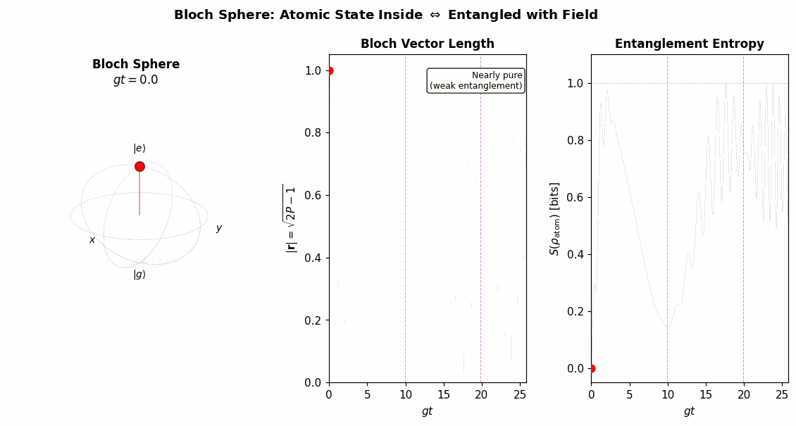
</p>

The reduced atomic state $\rho\_{\text{atom}} = \mathrm{Tr}\_{\text{field}}[\rho]$ traces a trajectory inside the Bloch sphere. A pure atomic state sits on the surface ($|\mathbf{r}| = 1$); entanglement with the field pulls the Bloch vector toward the center ($|\mathbf{r}| \to 0$, maximally mixed). **Left:** 3D Bloch sphere trajectory color-coded by time. The atom starts at the excited state (red dot, north pole) and spirals inward during the collapse (entanglement with the field). Near $t = t_r/2$ (gold star) it returns close to the surface ($|\mathbf{r}| = 0.96$): the atom is nearly pure again because it has **disentangled** from the field, which is then in a cat state. Around the first revival (green triangle) the Bloch vector plunges back inside as the branches rephase and re-entangle. **Center:** Bloch vector length $|\mathbf{r}|(t)$. **Right:** Von Neumann entropy $S(\rho\_{\text{atom}})$.

### Wigner vs Husimi Q-Function

<p align="center">
  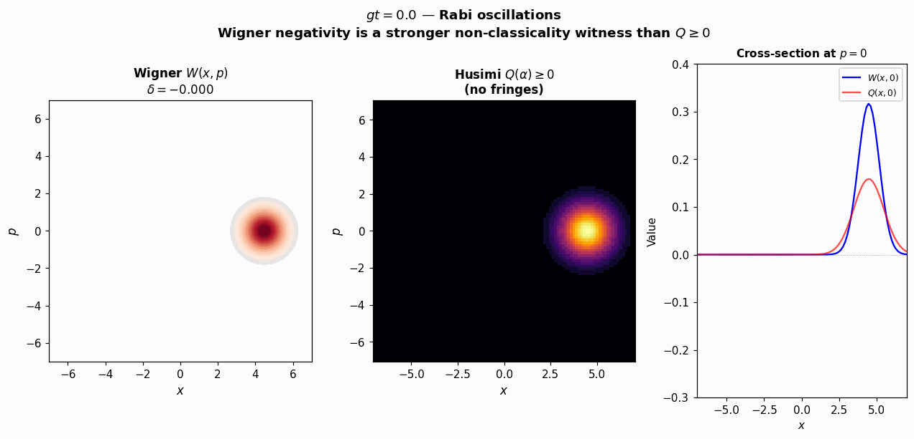
</p>

Side-by-side comparison of the Wigner function $W(x,p)$ (top row) and Husimi Q-function $Q(\alpha) = \langle\alpha|\rho|\alpha\rangle/\pi$ (bottom row) during JC evolution with $\bar{n} = 10$. The Wigner function takes negative values — the negativity volume $\delta$ (shown in each panel) quantifies non-classicality. The Husimi Q is a Gaussian-smoothed Wigner function ($Q = W * G_\text{vacuum}$) and is non-negative by construction ($Q \geq 0$ always). At $t = t_r/2$ the Wigner function resolves the interference fringes sharply, while the Q-function shows only two smooth lobes. This demonstrates that Wigner negativity, not Q-function structure, is the proper witness of quantum coherence in phase space.

### Cat-State Decoherence Sweep

<p align="center">
  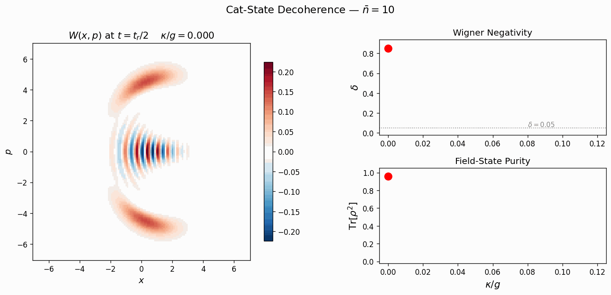
</p>

The cat state at $t = t_r/2$ is progressively destroyed as cavity decay $\kappa/g$ increases from 0 to 0.12, with $\bar{n} = 10$ held fixed. **Left:** Wigner function $W(x,p)$ of the reduced cavity field. At $\kappa = 0$, the full interference pattern is visible between the two coherent lobes — deep negative fringes certifying a macroscopic quantum superposition. As $\kappa$ increases, the fringes wash out first (they are encoded in high-order off-diagonal elements $\langle n|\rho|n + 2k\rangle$ with $k \gg 1$), while the two classical lobes persist longer. By $\kappa/g \approx 0.04$ the negativity volume has dropped below our observability threshold $\delta = 0.05$ (and to $\approx 0.002$ by $\kappa/g = 0.1$) — the cat has decohered into an essentially classical mixture. **Right top:** Wigner negativity volume $\delta(\kappa/g)$ tracing the quantitative loss of non-classicality; the horizontal grey line marks $\delta = 0.05$, our operational threshold for observability. **Right bottom:** Field-state purity $\mathrm{Tr}[\rho_\text{field}^2]$, which drops from ~0.96 (near-pure cat state) to ~0.38 (highly mixed), confirming that decoherence (fringe erasure) proceeds much faster than energy dissipation (photon loss).

### Photon Blockade Transition

<p align="center">
  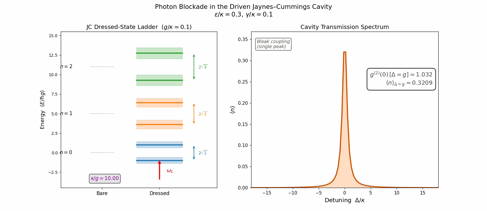
</p>

The transition from weak to strong coupling as $g/\kappa$ is swept from 0.1 to 12. **Left:** Energy-level diagram of the first three JC manifolds ($n = 0, 1, 2$) in units of $\hbar g$, with linewidth bands (shaded) that visibly shrink as $\kappa/g$ decreases. A red arrow marks the coherent drive; the red ✗ marks the blocked second-photon transition once the anharmonic splitting exceeds the linewidth. **Right:** Cavity transmission spectrum $\langle n \rangle(\Delta)$ computed from the steady-state Lindblad equation at each $g/\kappa$. At weak coupling ($g \ll \kappa$), the spectrum is a single Lorentzian centered at $\Delta = 0$ — the atom is too weakly coupled to modify the cavity response. As $g$ crosses $\kappa$, the peak broadens and flattens. At $g/\kappa \gtrsim 2$, the spectrum splits into two resolved peaks at $\Delta = \pm g$ — the **vacuum Rabi doublet**, the spectroscopic signature of strong coupling. The splitting grows as $2g$ (red annotation), directly mirroring the dressed-state gap in the energy ladder. Numerical readouts track $g^{(2)}(0)$ with the drive resonant with the lower polariton ($\Delta = \omega_c - \omega_L = g$), dropping from ~1 to deep antibunching (0.03 at $g/\kappa = 10$), and $\langle n \rangle$ at that detuning. Driving on *bare-cavity* resonance ($\Delta = 0$) in strong coupling gives the opposite: the laser is detuned from both polaritons, $\langle n\rangle \sim 10^{-8}$ and $g^{(2)}(0) \gg 1$ (bunching), so that is not the blockade signature.

---

## Static Figures

### Dressed-State Avoided Crossing and $\sqrt{n+1}$ Scaling

<p align="center">
  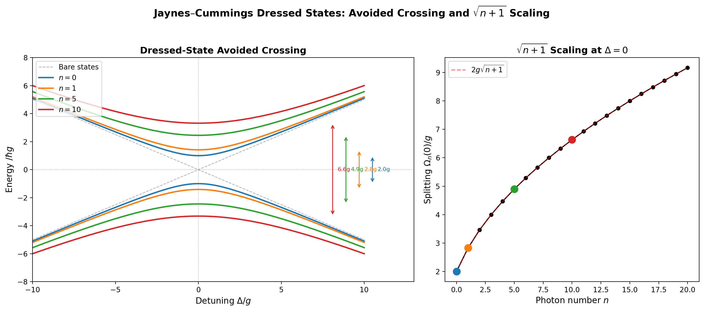
</p>

**Left:** Dressed-state energy eigenvalues $E_{n,\pm}$ as a function of detuning $\Delta/g$ for photon manifolds $n = 0$ (blue), $1$ (orange), $5$ (green), $10$ (red). At resonance ($\Delta = 0$), each manifold exhibits an avoided crossing with splitting $\Omega_n(0) = 2g\sqrt{n+1}$, indicated by colored arrows. **Right:** On-resonance splitting $\Omega_n(0)/g$ vs photon number $n$ (black dots), overlaid with the analytic curve $2\sqrt{n+1}$ (dashed pink). The $\sqrt{n+1}$ dependence is the quantum-mechanical fingerprint of the quantized field: a classical drive would produce a splitting independent of intensity.

### Photon Number Distribution at Six Key Times

<p align="center">
  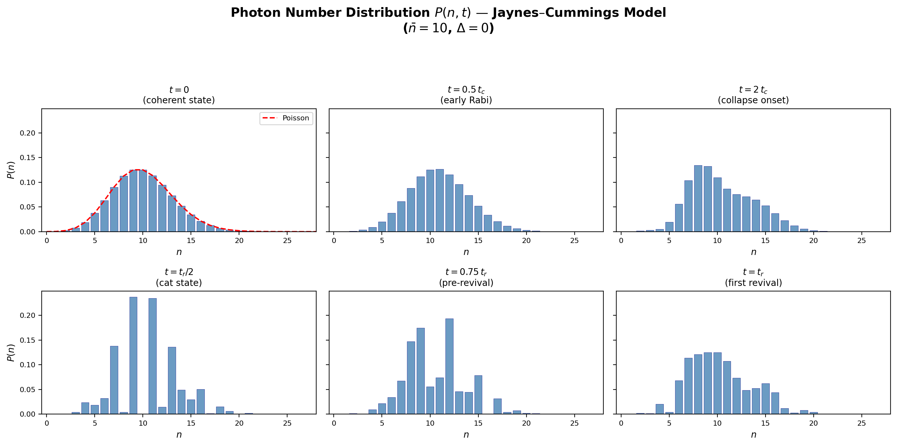
</p>

Snapshots of the intracavity photon number distribution $P(n,t)$ at six characteristic times during JC evolution ($\bar{n} = 10$, $\Delta = 0$). **(a)** $t = 0$: initial Poissonian distribution. **(b)** $t = 0.5\,t_c$: early Rabi oscillations, still approximately unimodal. **(c)** $t = 2\,t_c$: collapse onset, broadening as different Fock components oscillate at incommensurate $\sqrt{n+1}$ frequencies. **(d)** $t = t_r/2$ (cat state): odd-$n$ parity comb (the two cat branches have equal $|\beta|$, so the signature is interference between them, not a bimodal split). **(e)** $t = 0.75\,t_r$: partial recombination. **(f)** $t = t_r$ (first revival): partially recovered unimodal shape, broader than the initial Poissonian.

### Bloch Sphere Dynamics of the Reduced Atomic State

<p align="center">
  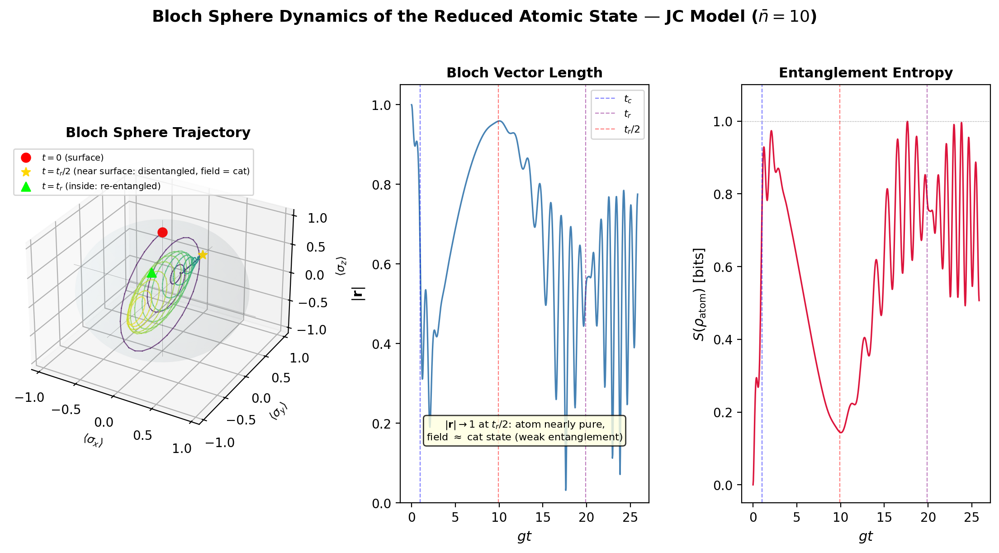
</p>

**Left:** 3D trajectory of the reduced atomic Bloch vector $\mathbf{r} = (\mathrm{Tr}[\rho_\text{atom}\sigma_x],\, \mathrm{Tr}[\rho_\text{atom}\sigma_y],\, \mathrm{Tr}[\rho_\text{atom}\sigma_z])$ during one full collapse-revival cycle. The atom starts at the excited state (red dot, $|\mathbf{r}| = 1$), spirals inward during the collapse, returns to $|\mathbf{r}| = 0.96$ near the surface at $t = t_r/2$ (gold star: atom nearly pure, disentangled from the field cat), and plunges back inside around $t = t_r$ (green triangle: re-entangled). **Center:** Bloch vector length $|\mathbf{r}|(t)$. **Right:** Von Neumann entropy $S(\rho_\text{atom})$. Vertical dashed lines mark $t_c$ (blue), $t_r/2$ (pink), and $t_r$ (purple).

### Wigner vs Husimi Q-Function Comparison

<p align="center">
  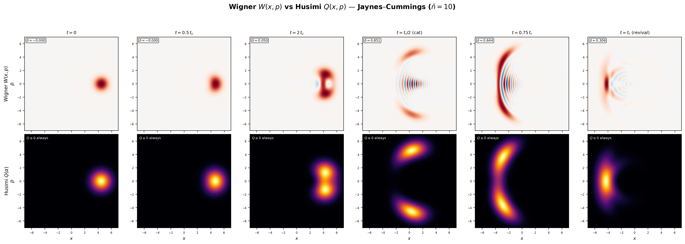
</p>

Side-by-side snapshots at six characteristic times. Each Wigner panel is annotated with the negativity volume $\delta$. At $t = t_r/2$, the Wigner function exhibits oscillatory fringes with $\delta = 0.85$, while the Q-function shows only two smooth, positive peaks. At $t = t_r$, residual negativity ($\delta = 0.31$) reflects imperfect refactorization.

### Cat-State Survival Phase Diagram

<p align="center">
  
</p>

Systematic 2D parameter sweep (16 × 16 = 256 independent Lindblad simulations) mapping cat-state survival in the $(\bar{n},\, \kappa/g)$ plane at $t = t_r/2$. **(a)** Wigner negativity volume $\delta(\bar{n}, \kappa/g)$. The cyan contour marks $\delta = 0.05$ — the practical boundary below which cat-state interference fringes are unobservable. At $\kappa = 0$, negativity grows with $\bar{n}$ and saturates near $\delta \approx 0.88$ for $\bar{n} \gtrsim 14$. Any nonzero $\kappa$ degrades the cat: the $\delta = 0.05$ boundary follows $\kappa_c/g \approx 0.46\,\bar{n}^{-1.14}$ (fit over $\bar{n} = 4$–$25$), between the naive $1/\bar{n}$ and the $\bar{n}^{-3/2}$ estimate of Sec. 3 below. **(b)** Cat fidelity $F_\text{cat} = \max_{\beta,\theta}\langle\text{cat}|\rho_\text{field}|\text{cat}\rangle$ with $|\text{cat}\rangle \propto |\beta\rangle + e^{i\theta}|-\beta\rangle$ and $\beta$ near $i\sqrt{\bar{n}}$. The JC cat lives on the $p$ axis and is approximately *odd*, so comparing with the even cat $|\alpha\rangle + |-\alpha\rangle$ on the real axis would give $F \approx 0$ for every $\bar{n} \gtrsim 3$. Without dissipation $F_\text{cat} \approx 0.78$ for every $\bar{n}$ from 2 to 25: the JC interaction produces a cat of essentially fixed quality, and the $F = 0.5$ contour (cyan) tracks the $\delta = 0.05$ contour.

### Cat-State Survival: Parameter Slices

<p align="center">
  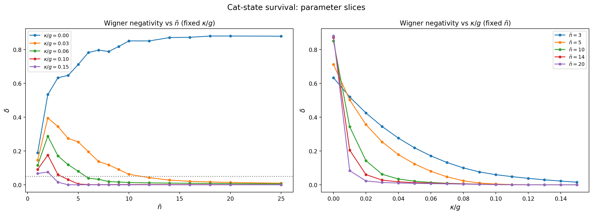
</p>

1D slices through the phase diagram. **Left:** $\delta$ vs $\bar{n}$ at fixed $\kappa/g$. Without dissipation ($\kappa = 0$, blue), negativity grows with $\bar{n}$ and saturates near $\delta \approx 0.88$ for $\bar{n} \gtrsim 14$. Modest decay ($\kappa/g = 0.03$, orange) limits the range with $\delta > 0.05$ to $\bar{n} \lesssim 10$. The horizontal grey line marks $\delta = 0.05$. **Right:** $\delta$ vs $\kappa/g$ at fixed $\bar{n}$. The decay is approximately exponential in $\kappa$, with a decay constant that shrinks roughly as $\bar{n}^{-1.1}$ — the enhanced decoherence rate of macroscopic superpositions.

### Photon Blockade: $g^{(2)}(0)$ vs Coupling Strength

<p align="center">
  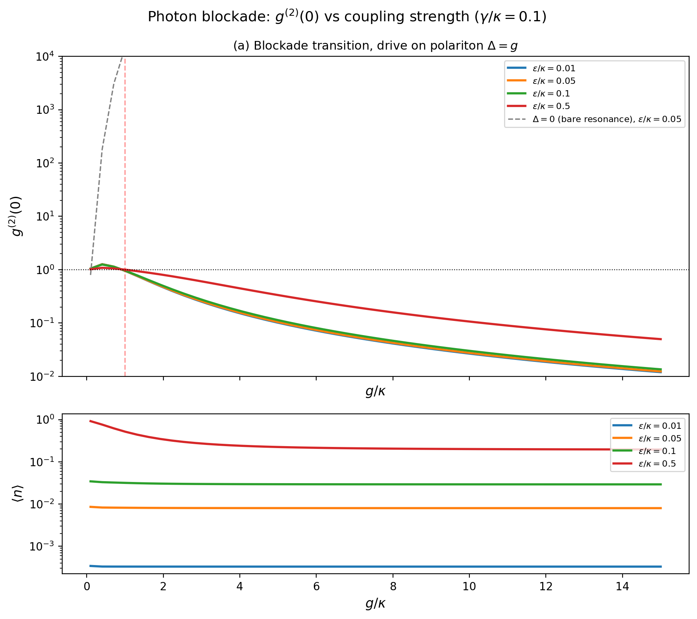
</p>

Equal-time second-order coherence $g^{(2)}(0)$ of the intracavity field as a function of the vacuum Rabi coupling $g/\kappa$, with the drive resonant with the lower polariton ($\Delta = \omega_c - \omega_L = g$), for several drive amplitudes $\varepsilon/\kappa$. At weak coupling ($g \ll \kappa$) the cavity responds linearly and $g^{(2)}(0) \to 1$ (a coherently driven damped cavity is in a coherent state). As $g$ exceeds $\kappa$ (red dashed line) the anharmonic JC ladder blocks the second photon and $g^{(2)}(0)$ falls steadily (0.11 at $g/\kappa = 5$, 0.03 at $g/\kappa = 10$ for $\varepsilon/\kappa = 0.05$); weaker drives give deeper antibunching. The grey dashed line shows the same sweep with the drive on *bare-cavity* resonance ($\Delta = 0$): the laser is then detuned from both polaritons while the two-photon transition $|0\rangle \to |2,\pm\rangle$ is only $g/\sqrt{2}$ away, so $\langle n\rangle$ collapses to $\sim 10^{-8}$ and $g^{(2)}(0)$ climbs to $\sim 10^7$ — strong *bunching*, not blockade. **Bottom:** mean intracavity photon number $\langle n \rangle$ at $\Delta = g$.

### Photon Statistics vs Drive Strength

<p align="center">
  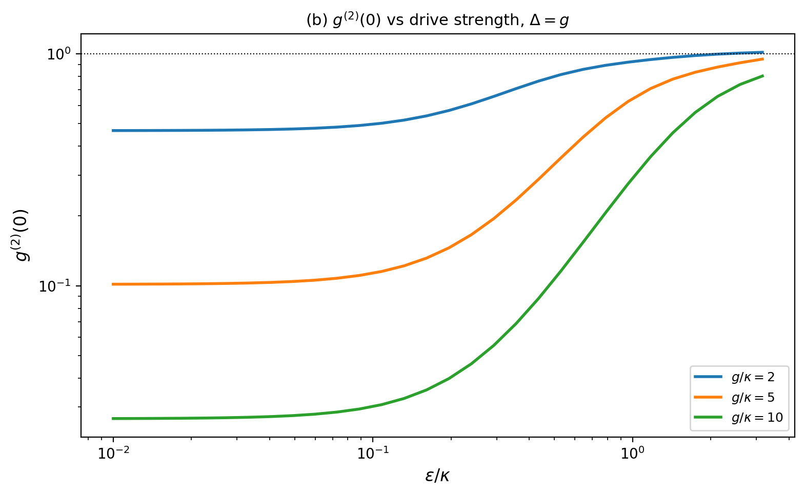
</p>

$g^{(2)}(0)$ as a function of drive strength $\varepsilon/\kappa$ for several values of $g/\kappa$, drive on the polariton ($\Delta = g$). At weak drive the blockade sets $g^{(2)}(0) \approx 0.5$, 0.10 and 0.03 for $g/\kappa = 2$, 5 and 10. As $\varepsilon/\kappa$ grows past $\sim 0.3$ the drive overwhelms the anharmonicity and $g^{(2)}(0)$ rises monotonically toward the coherent-state value 1. Stronger coupling ($g/\kappa = 10$, green) maintains antibunching to higher drive powers.

### Photon Blockade Spectrum

<p align="center">
  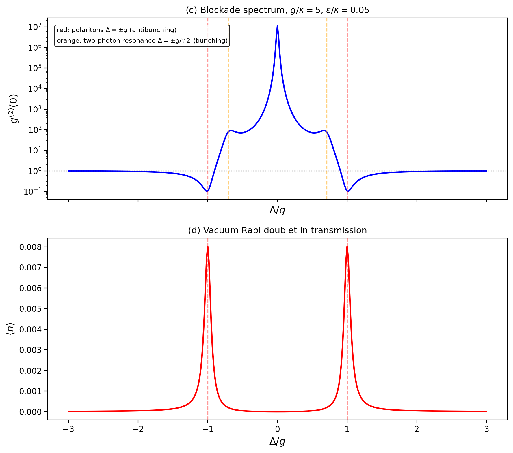
</p>

**Top:** $g^{(2)}(0)$ as a function of laser-cavity detuning $\Delta/g$ for $g/\kappa = 5$, $\varepsilon/\kappa = 0.05$ (log scale). The antibunching dips ($g^{(2)}(0) \approx 0.1$) occur *at* the polariton resonances $\Delta = \pm g$ (red dashed lines): the first photon is absorbed resonantly, the second is blocked by the anharmonic ladder. Between them, the two-photon resonances at $\Delta = \pm g/\sqrt{2}$ (orange dashed lines), where $2\omega_L$ matches $E_{2,\pm}$, produce strong bunching ($g^{(2)}(0) \sim 10^2$), and on bare resonance $\Delta = 0$ the drive is far from every single-photon transition, $\langle n\rangle$ is tiny and $g^{(2)}(0)$ reaches $\sim 10^7$. **Bottom:** vacuum Rabi doublet in the cavity transmission spectrum $\langle n \rangle(\Delta)$ — the splitting of $2g$ is the spectroscopic signature of strong coupling.

### $g^{(2)}$ Combined Summary

<p align="center">
  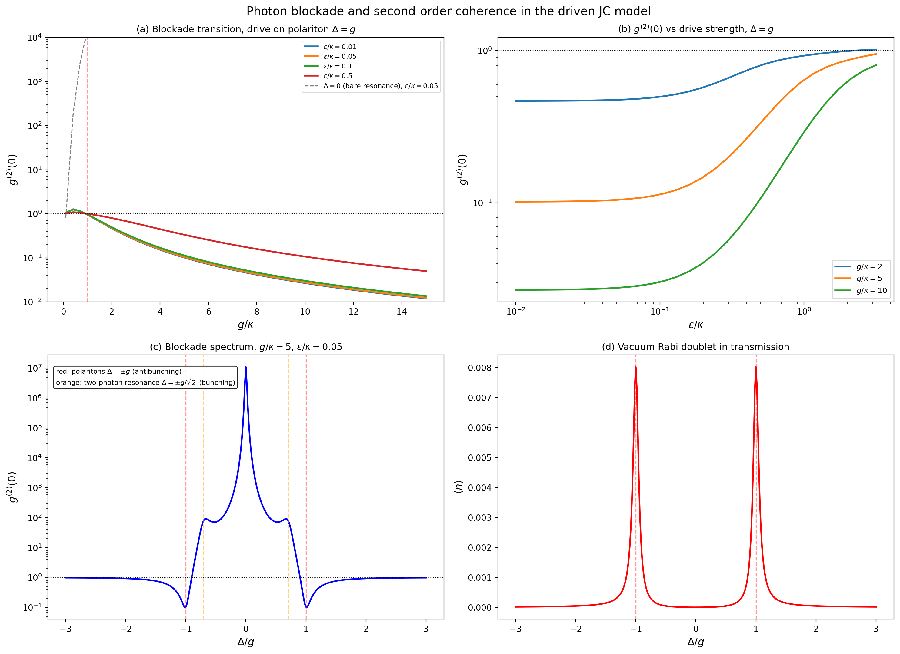
</p>

Four-panel summary of photon blockade physics (drive on the polariton, $\Delta = g$, unless stated): **(a)** blockade transition vs $g/\kappa$, with the bare-resonance ($\Delta = 0$) bunching curve for contrast, **(b)** quantum-to-classical crossover vs drive strength, **(c)** blockade spectrum, **(d)** vacuum Rabi splitting in transmission.

### Cat-State Detail

<p align="center">
  
</p>

Cross-section $W(x, p{=}0)$ through the Wigner function at the cat-state time $t = t_r/2$ ($\delta = 0.85$, purity 0.96, $F_\text{cat} = 0.78$). Deep negative fringes reach $W \approx -0.25$, with fringe spacing $\pi / \sqrt{2\bar{n}} \approx 0.70$.

### Entanglement Across Field States

<p align="center">
  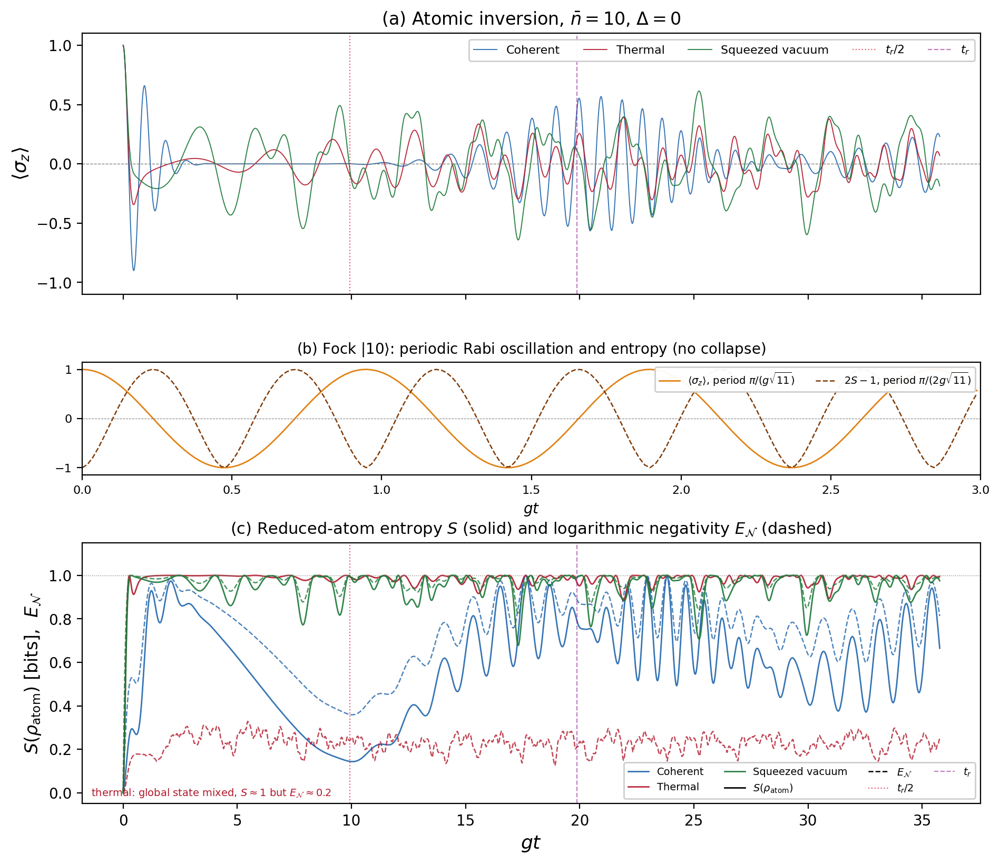
</p>

Reduced-atom entropy $S(\rho_\text{atom})$ (solid) and logarithmic negativity $E_\mathcal{N}$ (dashed) for four initial fields with $\bar{n} = 10$. **Coherent** (blue): collapse to ~1 bit, then a minimum $S \approx 0.14$ bit at $t_r/2$ (atom–field disentanglement; the field is the cat), then re-entanglement toward $t_r$. **Thermal** (red): $S$ saturates at 1 bit but $E_\mathcal{N} \approx 0.2$ — the global state is mixed and most of $S$ is classical correlation. **Squeezed vacuum** (green): partial dips only. **Fock $|10\rangle$** (panel b): strictly periodic, inversion period $\pi/(g\sqrt{11})$ and entropy period $\pi/(2g\sqrt{11})$. Thermal and squeezed states use $N_\text{cav} = 150$ ($N_\text{cav} = 50$ would truncate 1–3% of their weight and lower $\langle n\rangle$ to 9.6 and 9.2).

### Entropy Scaling with Photon Number

<p align="center">
  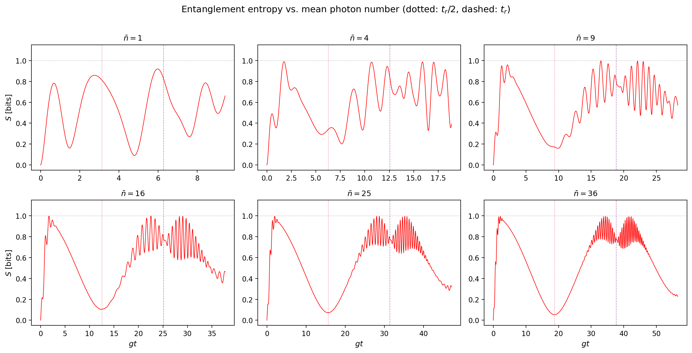
</p>

The collapse time $t_c \sim 1/g$ is independent of $\bar{n}$, while the half-revival time $\pi\sqrt{\bar{n}}/g$ (dotted) and $t_r = 2\pi\sqrt{\bar{n}}/g$ (dashed) scale as $\sqrt{\bar{n}}$. The entropy minimum at $t_r/2$ (disentanglement) deepens with $\bar{n}$ and is cleanly resolved for $\bar{n} \gtrsim 9$.

### Dissipative Entanglement

<p align="center">
  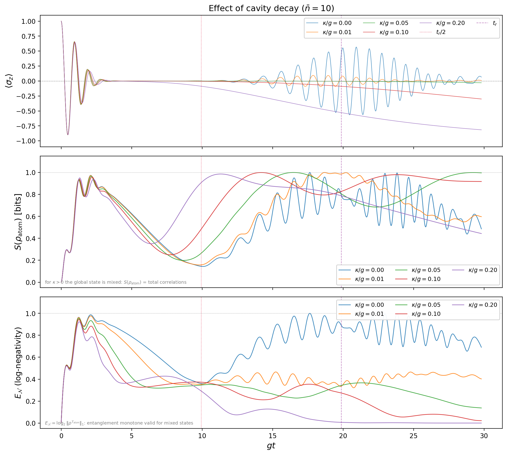
</p>

Inversion, reduced entropy and logarithmic negativity $E_\mathcal{N}$ under cavity loss. For $\kappa > 0$ the global state is mixed, so $S$ no longer measures entanglement: for $\kappa/g \geq 0.05$ it saturates near 1 bit at late times while $E_\mathcal{N}$ decays to zero. The inversion revival is gone by $\kappa/g = 0.05$, whereas $E_\mathcal{N}(t_r/2) \approx 0.35$ is almost unchanged up to $\kappa/g = 0.1$.

### Decoherence Table

| $\kappa/g$ | Wigner negativity $\delta$ | Field purity | Cat state visible? |
|-----------|--------------------------|--------------|-------------------|
| 0.00      | 0.851                    | 0.960        | Yes               |
| 0.02      | 0.143                    | 0.460        | Marginal          |
| 0.05      | 0.022                    | 0.418        | No                |
| 0.10      | 0.002                    | 0.386        | No                |

$\delta = \int|W|\,dx\,dp - 1$; values converged to three digits between $N_\text{cav} = 35$ and 50.

### Coherent vs Thermal Inversion

<p align="center">
  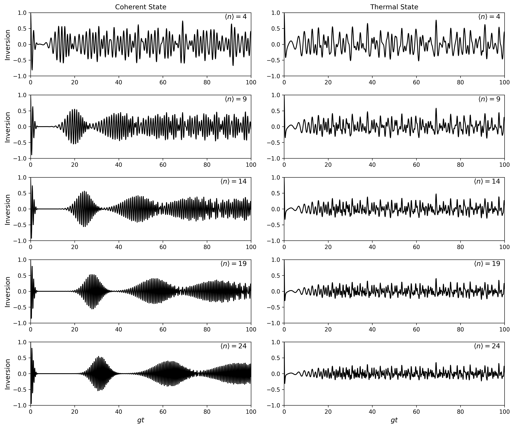
</p>

Atomic inversion $\langle\sigma_z\rangle(t) = \sum_n P(n)\cos(2g\sqrt{n{+}1}\,t)$ for coherent (Poisson) and thermal (Bose-Einstein) initial fields at $\bar{n} = 4, 9, 14, 19, 24$; time in units of $1/g$.

### Mollow Triplet

<p align="center">
  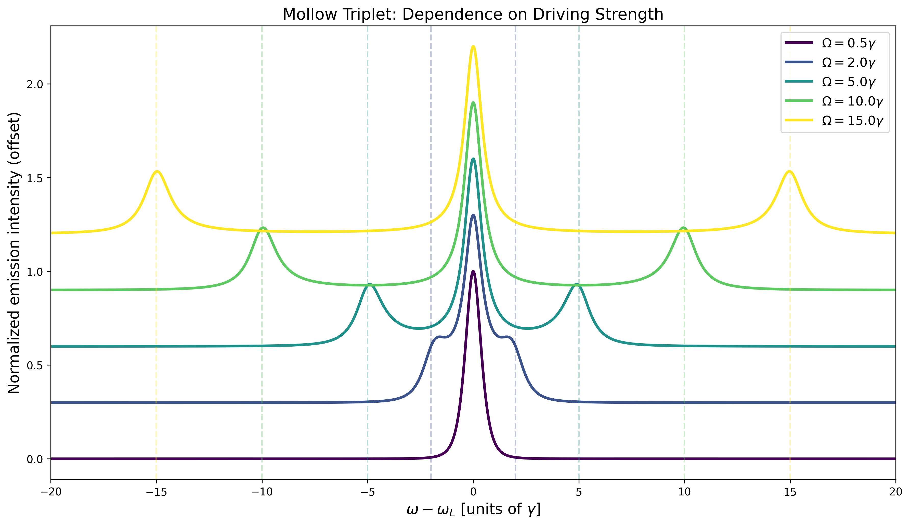
</p>

Resonance fluorescence spectrum via the quantum regression theorem. Sidebands at $\pm\Omega$ with HWHM $= 3\gamma/4$, peak ratio 3:1.

### Static Wigner Functions for Fock States

<p align="center">
  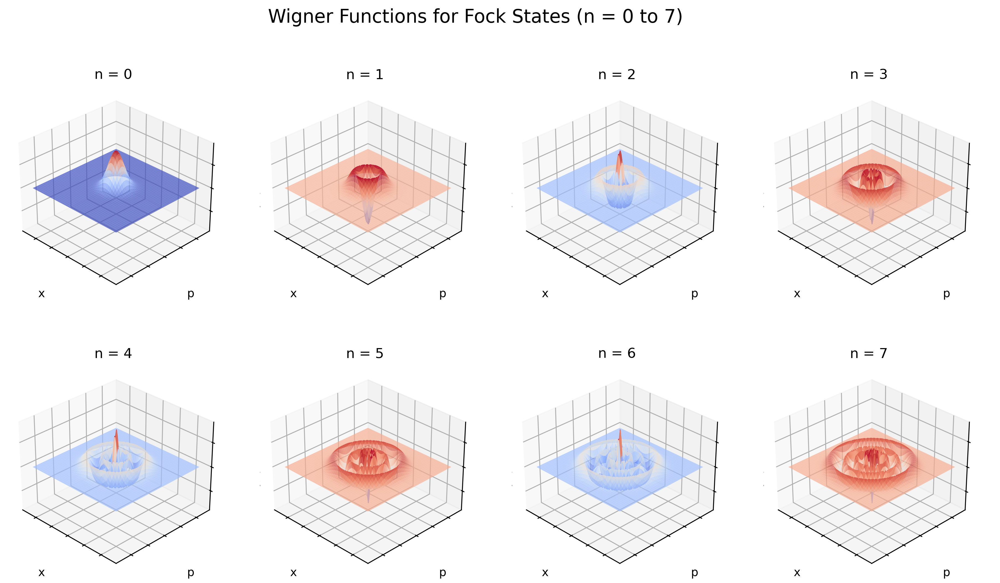
</p>

$W_n(x,p) = \frac{(-1)^n}{\pi} L_n(2r^2) e^{-r^2}$ for Fock states $|n\rangle$. Ring structure and negativity grow with $n$.

---

## Extended Theory

> **Note:** The full theoretical framework — JC Hamiltonian derivation, rotating-wave approximation, dressed states and eigenvalues, collapse and revival timescales, Wigner function formalism, Lindblad master equation, and von Neumann entropy — is presented in the [companion paper](paper/qsol_cqed.pdf) (Sections II–III). The sections below cover **new theoretical material** developed for the extended computational results in this repository.

### 1. Husimi Q-Function and the Phase-Space Smoothing Theorem

The Husimi Q-function is defined as the diagonal matrix element of the density operator in the coherent-state basis:

$$Q(\alpha) = \frac{1}{\pi}\langle\alpha|\rho|\alpha\rangle$$

Since $\rho$ is a positive operator and $|\alpha\rangle$ is a normalized state, it follows immediately that $Q(\alpha) \geq 0$ for all $\alpha$. This is in sharp contrast to the Wigner function, which can take negative values.

The precise relationship between $Q$ and $W$ is given by the **Gaussian convolution theorem**. In the phase-space convention used throughout this repository, $a = (x + ip)/\sqrt{2}$, a coherent state $|\alpha\rangle$ is centred at $(x, p) = \sqrt{2}(\mathrm{Re}\,\alpha, \mathrm{Im}\,\alpha)$ and the vacuum Wigner function is $W_{|0\rangle}(x,p) = \frac{1}{\pi}e^{-(x^2 + p^2)}$ (variance $1/2$ per quadrature). Then

$$Q(x, p) = \frac{1}{\pi}\int\!\!\int W(x', p')\,\exp\!\left[-\left((x' - x)^2 + (p' - p)^2\right)\right]dx'\,dp' = (W * W_{|0\rangle})(x,p),$$

normalized so that $\int Q\,dx\,dp = 1$. In other words, $Q$ is obtained by **smoothing $W$ with the vacuum Wigner function**, a minimum-uncertainty Gaussian of width equal to the vacuum fluctuation.

This smoothing has an irreversible information-theoretic consequence: a feature of $W$ with wavenumber $k$ is attenuated by the Fourier transform of the kernel, $e^{-k^2/4}$. For a cat state with components at $\pm\beta$ (separation $2\sqrt{2}|\beta|$ in these units) the interference term of $W$ oscillates with wavenumber $k = 2\sqrt{2}|\beta|$ (fringe spacing $\pi/(\sqrt{2}|\beta|)$; for $\bar{n} = |\beta|^2 = 10$ this is $0.70$, as observed). Convolving $e^{-p^2}\cos(kp)$ with the kernel gives an oscillation of *half* the wavenumber with amplitude reduced by $e^{-k^2/8} = e^{-|\beta|^2} = e^{-\bar{n}}$. For $\bar{n} = 10$ the residual fringes in $Q$ are suppressed by $e^{-10} \approx 5\times10^{-5}$, which is why the Q-function shows two smooth blobs while the Wigner function resolves the oscillatory structure (as demonstrated in our Wigner vs Q comparison figures). The same factor follows directly from $Q(\beta') \propto |\langle\beta'|\text{cat}\rangle|^2$: the cross term at the midpoint $\beta' = 0$ is $e^{-|\beta|^2}$ relative to the lobe maxima.

This can also be understood information-theoretically through the **Wehrl entropy** $h_W = -\int Q(\alpha)\ln Q(\alpha)\,d^2\alpha$, which satisfies the Lieb bound $h_W \geq 1$ (with equality only for coherent states) and is never smaller than the von Neumann entropy, $h_W \geq S(\rho)$; the gap quantifies the information lost by the Gaussian smoothing.

The practical implication is that **Wigner negativity, not Q-function structure, is the correct witness of quantum coherence in phase space.** The Q-function is useful for visualization but fundamentally cannot distinguish a quantum cat state $|\alpha\rangle + |-\alpha\rangle$ from a classical mixture $|\alpha\rangle\langle\alpha| + |-\alpha\rangle\langle-\alpha|$.

### 2. Schrödinger Cat-State Wigner Function and Fidelity

At time $t = t_r/2$, the JC interaction produces a cavity field state that closely approximates a two-component cat state whose branches sit at $\beta = \pm i\sqrt{\bar{n}}$ (on the $p$ axis, rotated by $\pm\pi/2$ from the initial amplitude $\alpha = \sqrt{\bar{n}}$) with a relative phase $\theta \approx 1.2\pi$ for $\bar{n} = 10$ — closer to an *odd* than to an even cat (photon-number parity $\langle(-1)^{\hat n}\rangle = -0.64$). For the algebra below we take the even cat along the real axis as the reference example; the JC cat is obtained by rotating $x \leftrightarrow p$ and changing the relative phase. The ideal even cat state and its normalization are

$$|\text{cat}^+\rangle = \mathcal{N}_+\bigl(|\alpha\rangle + |-\alpha\rangle\bigr), \qquad \mathcal{N}_+ = \frac{1}{\sqrt{2(1 + e^{-2|\alpha|^2})}}$$

The Wigner function of this state decomposes exactly into three terms (convention $a = (x+ip)/\sqrt{2}$):

$$W_\text{cat}(x,p) = \mathcal{N}_+^2\Bigl[W_\alpha(x,p) + W_{-\alpha}(x,p)\Bigr] + 2\mathcal{N}_+^2\,W_\text{int}(x,p)$$

where $W_{\pm\alpha}$ are the Gaussian Wigner functions of the two coherent components, centred at $x = \pm\sqrt{2}\alpha$, and the **interference term** is

$$W_\text{int}(x,p) = \frac{1}{\pi}\cos\!\bigl(2\sqrt{2}\,\alpha\,p\bigr)\,e^{-(x^2 + p^2)}$$

for $\alpha$ real ($\int W_\text{int}\,dx\,dp = e^{-2\alpha^2}$, which fixes the normalization). This interference term is responsible for the oscillatory fringes between the two lobes and is the sole source of Wigner negativity. The fringe spacing along the axis perpendicular to the branch separation is

$$\Delta_\text{fringe} = \frac{\pi}{\sqrt{2}\,\alpha} = \frac{\pi}{\sqrt{2\bar{n}}}$$

which for $\bar{n} = 10$ gives $0.70$, consistent with the simulated cross-section $W(x, p{=}0)$ (there the branches lie on the $p$ axis, so the fringes run along $x$).

The most negative value of the ideal cat is reached at the first dark fringe next to the origin, $2\sqrt{2}\alpha p = \pi$, where $W_\text{cat} \approx -\tfrac{2}{\pi}e^{-\pi^2/(8\alpha^2)} \approx -0.28$ for $\bar{n} = 10$. The simulated JC cat, which has fidelity 0.78 with the best two-component cat, reaches $W \approx -0.25$.

A key result is that **larger cat states have finer fringes.** Since $\Delta p \propto 1/\sqrt{\bar{n}}$, the fringe frequency grows with $\bar{n}$, making the interference pattern increasingly vulnerable to any smoothing process — whether instrumental (finite detector resolution) or physical (decoherence). This is the phase-space manifestation of the fragility of macroscopic superpositions.

We quantify the quality of the dynamically generated cat state using the **fidelity** with the best-fitting two-component cat,

$$F_\text{cat}(\bar{n}, \kappa/g) = \max_{\beta,\,\theta}\;\langle\text{cat}(\beta,\theta)|\,\rho_\text{field}(t_r/2)\,|\text{cat}(\beta,\theta)\rangle, \qquad |\text{cat}(\beta,\theta)\rangle \propto |\beta\rangle + e^{i\theta}|-\beta\rangle,$$

with $\beta$ scanned in a neighbourhood of $i\sqrt{\bar{n}}$ and $\theta \in [0, 2\pi)$. Comparing instead with the even cat $|\alpha\rangle + |-\alpha\rangle$ on the real axis gives $F \approx 0$ for every $\bar{n} \gtrsim 3$, simply because the JC branches sit on the $p$ axis with a non-even relative phase — a comparison with the wrong reference state, not a property of the dynamics. With the correct reference, our phase diagram shows $F_\text{cat} \approx 0.78$ at $\kappa = 0$ for every $\bar{n}$ from 2 to 25: the anharmonic $\sqrt{n+1}$ spectrum limits the cat quality to a fixed value rather than degrading it with $\bar{n}$. Dissipation lowers $F_\text{cat}$ (0.54 and 0.46 at $\kappa/g = 0.01$ and 0.02 for $\bar{n} = 10$), and the $F_\text{cat} = 0.5$ boundary scales as $\bar{n}^{-1.25}$, tracking the $\delta = 0.05$ boundary.

### 3. Microscopic Derivation of Enhanced Decoherence

The paper quotes the fringe decoherence rate $\Gamma_\text{dec} = 2\kappa\bar{n}$ following Zurek [22]. Here we derive it explicitly from the Lindblad dynamics.

Consider the master equation $\dot{\rho} = \kappa\mathcal{D}[a]\rho$ acting on the cavity field alone (ignoring the atom for this argument). We wish to compute the decay rate of the off-diagonal coherence $\langle\alpha|\rho|-\alpha\rangle$ between two coherent states separated by $2\alpha$ in phase space.

Using the coherent-state matrix elements of the Lindblad superoperator, and the eigenvalue relation $a|\alpha\rangle = \alpha|\alpha\rangle$:

$$\frac{d}{dt}\langle\alpha|\rho|-\alpha\rangle = \kappa\left[\alpha(-\alpha)^* - \frac{|\alpha|^2 + |-\alpha|^2}{2}\right]\langle\alpha|\rho|-\alpha\rangle$$

$$= \kappa\left[-|\alpha|^2 - |\alpha|^2\right]\langle\alpha|\rho|-\alpha\rangle = -2\kappa|\alpha|^2\,\langle\alpha|\rho|-\alpha\rangle$$

This gives the exact result:

$$\langle\alpha|\rho(t)|-\alpha\rangle = \langle\alpha|\rho(0)|-\alpha\rangle\,\exp\!\left(-2\kappa|\alpha|^2\,t\right)$$

The decoherence rate is therefore

$$\boxed{\Gamma_\text{dec} = 2\kappa|\alpha|^2 = 2\kappa\bar{n}}$$

This is a factor of $2\bar{n}$ faster than the energy decay rate $\kappa$. The physical interpretation is that each photon lost from the cavity carries "which-component" information about the cat state: a measurement of the photon's phase would distinguish $|\alpha\rangle$ from $|-\alpha\rangle$. The rate of such information leakage is proportional to the photon number.

The **decoherence time** is

$$t_\text{dec} = \frac{1}{2\kappa\bar{n}}$$

For the cat state to be observable, we need $t_\text{dec} \gtrsim t_r/2$, i.e., the cat must survive long enough to form. This requires

$$\frac{1}{2\kappa\bar{n}} \gtrsim \frac{\pi\sqrt{\bar{n}}}{g} \qquad \Longrightarrow \qquad \frac{\kappa}{g} \lesssim \frac{1}{2\pi\bar{n}^{3/2}}$$

For $\bar{n} = 10$ this crude criterion gives $\kappa/g \lesssim 0.005$, whereas the simulated $\delta = 0.05$ contour lies at $\kappa/g \approx 0.034$: the estimate is conservative because the branch separation, and with it the decoherence rate, builds up gradually during the collapse rather than being $2\sqrt{\bar{n}}$ from $t = 0$. The measured boundary scales as $\kappa_c/g \approx 0.46\,\bar{n}^{-1.14}$ (fit over $\bar{n} = 4$–$25$; $\bar{n}^{-1.26}$ for $\bar{n} \geq 8$, and $\bar{n}^{-1.25}$ for the $F_\text{cat} = 0.5$ boundary), i.e. between the naive $1/\bar{n}$ and the $\bar{n}^{-3/2}$ of this argument, which combines the $\bar{n}$-dependent decoherence rate with the $\bar{n}^{1/2}$-dependent formation time.

### 4. Second-Order Coherence and the Photon Blockade Effect

The equal-time second-order correlation function is defined as

$$g^{(2)}(0) = \frac{\langle a^\dagger a^\dagger a\,a\rangle}{\langle a^\dagger a\rangle^2} = \frac{\langle \hat{n}(\hat{n}-1)\rangle}{\langle \hat{n}\rangle^2} = 1 + \frac{\mathrm{Var}(\hat{n}) - \langle\hat{n}\rangle}{\langle\hat{n}\rangle^2}$$

This classifies photon statistics:

| $g^{(2)}(0)$ | Statistics | Physical meaning |
|:---:|:---:|:---|
| $0$ | Perfect antibunching | At most one photon present (single-photon source) |
| $< 1$ | Sub-Poissonian | Photon-number variance below shot noise |
| $= 1$ | Poissonian | Coherent-state (laser) statistics |
| $= 2$ | Thermal (chaotic) | Bose-Einstein bunching |
| $> 2$ | Super-thermal | Exotic multi-photon correlations |

The connection to the paper's Sec. V is that sub-Poissonian statistics ($g^{(2)}(0) < 1$) and photon antibunching are among the definitive criteria for non-classical light. Here we develop the full theory of how the JC nonlinearity produces antibunching via the photon blockade.

#### The Driven Dissipative JC Model

Adding a coherent drive of amplitude $\varepsilon$ at frequency $\omega_L$ and moving to the rotating frame:

$$H_\text{driven} = \Delta_c\,a^\dagger a + \frac{\Delta_a}{2}\sigma_z + g\bigl(a^\dagger\sigma^- + a\,\sigma^+\bigr) + \varepsilon\bigl(a^\dagger + a\bigr)$$

where $\Delta_c = \omega_c - \omega_L$ and $\Delta_a = \omega_a - \omega_L$. The steady state $\rho_\text{ss}$ is found from the Lindblad equation $0 = -i[H, \rho_\text{ss}] + \kappa\mathcal{D}[a]\rho_\text{ss} + \gamma\mathcal{D}[\sigma^-]\rho_\text{ss}$, and $g^{(2)}(0)$ is computed directly from $\rho_\text{ss}$.

#### The Blockade Mechanism

The photon blockade arises from the **anharmonicity of the JC energy ladder**. On resonance ($\Delta_c = \Delta_a = 0$), the dressed-state energies (from the paper's Eq. 14) give transition frequencies:

$$\omega_{0 \to 1,\pm} = \omega_c \pm g \qquad \text{(first photon)}$$

$$\omega_{1,\pm \to 2,\pm} = \omega_c \pm g(\sqrt{2} - 1) \quad \text{(same branch)}, \qquad \omega_{1,\mp \to 2,\pm} = \omega_c \pm g(\sqrt{2} + 1) \quad \text{(cross branch)} \qquad \text{(second photon)}$$

The energy cost of the first photon differs from the second by

$$\delta E_\text{block} = \hbar g\bigl(2 - \sqrt{2}\bigr) \approx 0.59\,\hbar g$$

A drive laser tuned to the first transition (say $\omega_L = \omega_c - g$) is therefore **detuned from the second transition** by $\delta E_\text{block}/\hbar$. If this detuning exceeds the dressed-state linewidth ($\sim \kappa$), the second photon cannot be absorbed while the first is still in the cavity. This is the photon blockade.

The blockade condition is:

$$\frac{g(2 - \sqrt{2})}{\kappa} \gg 1 \qquad \Longleftrightarrow \qquad \frac{g}{\kappa} \gg \frac{1}{2 - \sqrt{2}} \approx 1.71$$

In practice, our simulations (drive on the polariton, $\varepsilon/\kappa = 0.05$) give $g^{(2)}(0) = 0.11$ at $g/\kappa = 5$ and $0.03$ at $g/\kappa = 10$, the finite linewidth and multi-level structure softening the ideal step. The laser must sit on a polariton for this to work: on bare-cavity resonance ($\omega_L = \omega_c$) it is detuned by $g$ from both single-photon transitions but only by $g/\sqrt{2}$ from the two-photon transition $|0\rangle \to |2,\pm\rangle$, so the cavity is nearly empty ($\langle n\rangle \sim 10^{-8}$ at $g/\kappa = 5$) and $g^{(2)}(0) \sim 10^7$ — bunching, not blockade.

#### Drive Strength Crossover

At fixed $g/\kappa$, increasing the drive $\varepsilon$ eventually overwhelms the blockade. In the limit $\varepsilon \gg g$, the cavity is driven classically and $g^{(2)}(0) \to 1$. In our sweeps ($\Delta = g$, $\varepsilon/\kappa \leq 3$) the rise is monotonic: $g^{(2)}(0)$ approaches 1 from below, more slowly for larger $g/\kappa$.

#### Photon Blockade Spectrum

Sweeping the laser detuning $\Delta$ at fixed $g, \kappa, \varepsilon$ maps out the spectral structure of the blockade. The transmission spectrum $\langle n\rangle(\Delta)$ shows the vacuum Rabi doublet (peaks at $\Delta = \pm g$), while $g^{(2)}(0)(\Delta)$ reveals:

- **Antibunching dips** *at* the polariton resonances $\Delta = \pm g$ ($g^{(2)}(0) \approx 0.1$ for $g/\kappa = 5$), where the first photon is absorbed resonantly and the second is blocked
- **Bunching spikes** at the two-photon resonances $\Delta = \pm g/\sqrt{2}$, where $2\omega_L$ matches $E_{2,\pm} = 2\omega_c \pm \sqrt{2}g$ ($g^{(2)}(0) \sim 10^2$), and a very large bunching peak on bare resonance $\Delta = 0$, where the single-photon transitions are far off resonance and the cavity is almost empty

This spectral structure is the fingerprint of the quantized JC ladder and has been directly observed in circuit QED experiments.

### 5. Bloch Vector Dynamics and the Geometry of Entanglement

The reduced atomic state is a $2 \times 2$ density matrix, completely characterized by the Bloch vector:

$$\mathbf{r} = \bigl(\langle\sigma_x\rangle,\, \langle\sigma_y\rangle,\, \langle\sigma_z\rangle\bigr) = \bigl(\mathrm{Tr}[\rho_\text{atom}\sigma_x],\, \mathrm{Tr}[\rho_\text{atom}\sigma_y],\, \mathrm{Tr}[\rho_\text{atom}\sigma_z]\bigr)$$

A pure atomic state lies on the surface of the Bloch sphere ($|\mathbf{r}| = 1$); a maximally mixed state sits at the center ($|\mathbf{r}| = 0$). The Bloch vector length is related to the atomic purity by

$$\mathrm{Tr}[\rho_\text{atom}^2] = \frac{1 + |\mathbf{r}|^2}{2}$$

and to the von Neumann entropy by the binary entropy function:

$$S(\rho_\text{atom}) = h\!\left(\frac{1 + |\mathbf{r}|}{2}\right), \qquad h(p) = -p\log_2 p - (1{-}p)\log_2(1{-}p)$$

This provides a geometric interpretation of entanglement dynamics: **the atom's entanglement with the field is encoded in how far the Bloch vector has retreated from the surface toward the center** (for a globally pure state). During the collapse $|\mathbf{r}|$ drops rapidly from 1 to $\approx 0.2$ as the atom becomes strongly entangled with the field. At the cat-state time $t = t_r/2$ the Bloch vector has returned to $|\mathbf{r}| = 0.96$, close to the surface: the atom is nearly pure again because it has **disentangled** from the field, which is left in a nearly pure cat state (Gea-Banacloche, PRL **65**, 3385 (1990)). The cat state and the entanglement minimum are two descriptions of the same event.

The trajectory itself is not a simple radial contraction. In 3D, the Bloch vector traces a **spiral** because the coherent Rabi dynamics (rotation about an axis in the $xz$-plane) compete with the dephasing caused by the spread of Fock-state Rabi frequencies. The spiral structure is visible in our Bloch sphere animations: at early times the atom precesses rapidly (Rabi oscillations), while the envelope of the spiral contracts (collapse). The spiral re-expands toward the surface at $t_r/2$, then contracts again around the revival $t_r$ ($|\mathbf{r}| \approx 0.5$, oscillating at the Rabi frequency) as the branches rephase and re-entangle.

### 6. Photon Number Distribution Dynamics and the Number-Space Cat Signature

The photon number distribution $P(n,t) = \langle n|\rho_\text{field}(t)|n\rangle$ provides complementary information to the Wigner function. For the initial state $|e\rangle \otimes |\alpha\rangle$ evolving under the resonant JC Hamiltonian, each component $|e,n\rangle$ evolves into $\cos(g\sqrt{n+1}\,t)|e,n\rangle - i\sin(g\sqrt{n+1}\,t)|g,n{+}1\rangle$, so the reduced field has the exact diagonal elements

$$P(n,t) = p(n)\cos^2\!\bigl(g\sqrt{n+1}\,t\bigr) + p(n-1)\sin^2\!\bigl(g\sqrt{n}\,t\bigr), \qquad p(n) = e^{-\bar{n}}\frac{\bar{n}^n}{n!}.$$

At $t = 0$ this is the Poisson distribution. At $t = t_r/2 = \pi\sqrt{\bar{n}}/g$ the phases $g\sqrt{n+1}\,t \approx \pi\bar{n} + \tfrac{\pi}{2}(n + 1 - \bar{n})$ alternate by $\pi/2$ from one $n$ to the next, so $\cos^2$ and $\sin^2$ switch between 0 and 1 with the *parity* of $n$: $P(n,t_r/2)$ becomes a comb in which (for $\bar{n} = 10$) odd photon numbers carry 82% of the weight and $\langle(-1)^{\hat n}\rangle = -0.64$. This is the number-space signature of the cat state: the two branches at $\pm i\sqrt{\bar{n}}$ have the *same* $|\beta|$, so their Poisson envelopes coincide and no bimodal split appears; what survives is their interference, an (approximately odd) parity comb. Such a comb provides an experimentally accessible signature of cat-state parity that does not require full Wigner tomography.

At the revival time $t_r$ the phases alternate by $\pi$ instead, the comb disappears and a single hump returns, but the anharmonicity of the JC spectrum ($\sqrt{n+1}$ rather than linear) prevents perfect recurrence. The distribution at $t = t_r$ is broader and more irregular than the initial Poissonian, with a variance that exceeds $\bar{n}$ — the field has acquired super-Poissonian statistics through its interaction with the atom.

### 7. Cat-State Survival Phase Diagram: Interpretation

The 2D parameter sweep over $(\bar{n}, \kappa/g)$ is the central new computational result. The phase diagram encodes two competing effects:

**Negativity grows with $\bar{n}$ at $\kappa = 0$.** In the ideal (lossless) case, larger $\bar{n}$ produces cat states with sharper interference fringes and larger $\delta$. The negativity saturates near $\delta \approx 0.88$ for $\bar{n} \gtrsim 14$, while the cat fidelity stays at $F_\text{cat} \approx 0.78$ for all $\bar{n} \geq 2$.

**Decoherence accelerates with $\bar{n}$ at $\kappa > 0$.** From Sec. 3, the decoherence rate $\Gamma_\text{dec} = 2\kappa\bar{n}$ grows linearly with $\bar{n}$, while the formation time $t_r/2 = \pi\sqrt{\bar{n}}/g$ grows as $\sqrt{\bar{n}}$. The product $\Gamma_\text{dec} \cdot t_r/2 = 2\pi\kappa\bar{n}^{3/2}/g$ grows as $\bar{n}^{3/2}$, meaning that larger cat states are **exponentially harder to observe** at any fixed nonzero $\kappa$.

The **critical decay rate** for cat-state survival scales as

$$\frac{\kappa_\text{crit}}{g} \sim \frac{C}{\bar{n}^{3/2}}$$

where $C$ is a threshold constant that depends on the observability criterion for $\delta$. Our phase diagram gives $\kappa_c/g \approx 0.46\,\bar{n}^{-1.14}$ over $\bar{n} = 4$–$25$ ($\bar{n}^{-1.26}$ for $\bar{n} \geq 8$): steeper than the naive $1/\bar{n}$ but shallower than this $\bar{n}^{-3/2}$ estimate, because the branch separation grows gradually during the collapse.

The parameter slices provide practical design guidance. To observe a cat state with $\delta > 0.05$ at $\bar{n} = 10$, one requires $\kappa/g \lesssim 0.034$, i.e., $g/\kappa \gtrsim 30$. This condition is achievable in microwave cavity QED ($g/\kappa \sim 10^4$) and circuit QED ($g/\kappa \sim 100\text{–}300$), but remains challenging in optical cavities where typical $g/\kappa \sim 1\text{–}10$.

---

## Simulation Details

### Parameters

| Parameter | Symbol | Default |
|-----------|--------|---------|
| Vacuum Rabi coupling | $g$ | 1.0 |
| Mean photon number | $\bar{n}$ | 10 |
| Fock truncation | $N_\text{cav}$ | 35–50 (coherent, Fock); 150 (thermal, squeezed); $3\bar{n}+20$ (sweeps) |
| Cavity decay | $\kappa/g$ | 0–0.2 |
| Atom decay | $\gamma/\kappa$ | 0.1 (driven-cavity sweeps) |
| Drive amplitude | $\varepsilon/\kappa$ | 0.01–3 (laser on the polariton, $\Delta = g$) |
| Collapse time | $t_c$ | $\equiv 1/g$ (operational; Gaussian envelope $e^{-g^2t^2/2}$) |
| Revival time | $t_r$ | $2\pi\sqrt{\bar{n}}/g$ |

### Figure-to-Script Map

| Output | Script |
|--------|--------|
| `figures/fig_avoided_crossing`, `animations/anim_avoided_crossing.gif` | `simulations/animation/sim_avoided_crossing.py` |
| `figures/fig_photon_number_evolution`, `animations/anim_photon_number.gif` | `simulations/animation/sim_photon_number_distribution.py` |
| `figures/fig_bloch_sphere_trajectory`, `animations/anim_bloch_sphere.gif` | `simulations/animation/sim_bloch_sphere.py` |
| `figures/fig_q_vs_wigner`, `animations/anim_q_vs_wigner.gif` | `simulations/animation/sim_q_vs_wigner.py` |
| `figures/fig_phase_diagram` / `fig_phase_combined` / `fig_phase_slices` / `fig_cat_fidelity`, `phase_diagram_data.npz` | `simulations/sim_phase_diagram.py` |
| `figures/fig_g2_vs_coupling` / `fig_g2_vs_drive` / `fig_g2_blockade_spectrum` / `fig_g2_combined`, `g2_data.npz` | `simulations/sim_g2_coherence.py` |
| `paper/figures/fig_inversion_snapshots` / `fig_wigner_evolution` / `fig_cat_state_detail` / `fig_wigner_decoherence` | `simulations/sim_wigner_evolution.py` |
| `paper/figures/fig_entanglement_comparison` / `fig_coherent_entropy_purity` / `fig_entropy_nbar_scaling` / `fig_dissipative_entanglement` | `simulations/sim_entanglement_dynamics.py` |
| `paper/figures/jaynes_cummings_*` | `simulations/jaynes_cummings_comparison.py` |
| `paper/figures/mollow_triplet_driving_strength` | `simulations/mollow_triplet.py` |
| `paper/figures/wigner_functions_3d` / `wigner_functions_2d` (paper Figs. 10–11) | `simulations/wigner_quantum_states.py` |
| `paper/figures/wigner_fock_individual` / `wigner_fock_combined` | `simulations/wigner_fock_states.py` |
| `animations/anim_wigner_evolution.gif`, `anim_entanglement.gif`, `anim_decoherence.gif`, `anim_phase_diagram.gif`, `anim_g2_blockade.gif` | the same-named `anim_*.py` in `simulations/animation/` |
| `paper/figures/banner_*` | static assets (no generating script) |

All scripts write to repo-relative paths (`figures/`, `animations/`, `paper/figures/`) and can be run from any working directory.

---

## Quick Start

```bash
git clone https://github.com/alanknguyen/QSOL_CQED.git
cd QSOL_CQED
pip install -r requirements.txt
```

Paper figures (written to `paper/figures/`):

```bash
cd simulations
python sim_wigner_evolution.py            # ~10 s
python sim_entanglement_dynamics.py       # ~1 min (thermal/squeezed at N_cav = 150)
python jaynes_cummings_comparison.py      # ~5 s
python wigner_quantum_states.py           # ~10 s
python wigner_fock_states.py              # ~5 s
python mollow_triplet.py                  # ~5 s
```

Repository figures and sweeps (written to `figures/`):

```bash
cd simulations
python sim_g2_coherence.py                # ~30 s
python sim_phase_diagram.py               # ~2 min (256 Lindblad solves + cat-fidelity fits)
```

Static figures plus GIFs (written to `figures/` and `animations/`):

```bash
cd simulations/animation
python sim_avoided_crossing.py            # ~10 s
python sim_photon_number_distribution.py  # ~15 s
python sim_bloch_sphere.py                # ~20 s
python sim_q_vs_wigner.py                 # ~20 s
python anim_wigner_evolution.py           # ~1 min
python anim_entanglement.py               # ~1 min
python anim_decoherence.py                # ~1 min
python anim_phase_diagram.py              # ~1 min
python anim_g2_blockade.py                # ~1 min
```

Timings are for an Apple-silicon laptop with QuTiP 5.2.3, NumPy 2.4, SciPy 1.15. Frames are rendered to a temporary directory and removed after the GIF is assembled. To rebuild the manuscript: `cd paper && tectonic qsol_cqed.tex` (or `latexmk -pdf` with REVTeX 4.2 installed).

---

## Citation

```bibtex
@article{nguyen2026quantum,
  author  = {Nguyen, Nguyen Khoi},
  title   = {Quantum States of Light in Cavity {QED}: A Computational Study
             of {Wigner} Function Dynamics and Atom-Field Entanglement
             in the {Jaynes-Cummings} Model},
  journal = {arXiv preprint arXiv:XXXX.XXXXX},
  year    = {2026},
}
```

## License

MIT. See [LICENSE](LICENSE).

## Acknowledgments

Prepared under the guidance of Prof. Luca Dal Negro at Boston University (EC 585, EC 777). Simulations use [QuTiP](https://qutip.org/) by J. R. Johansson, P. D. Nation, and F. Nori.
